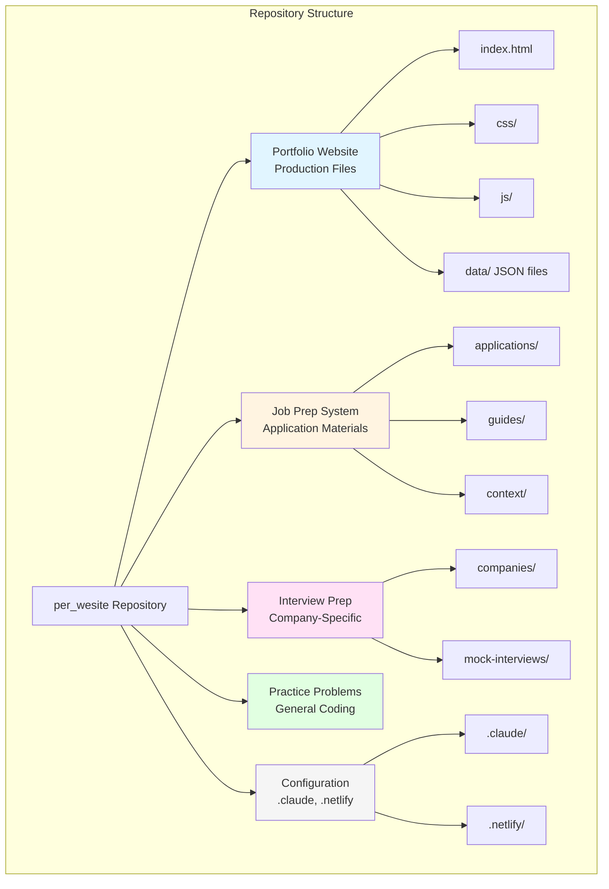
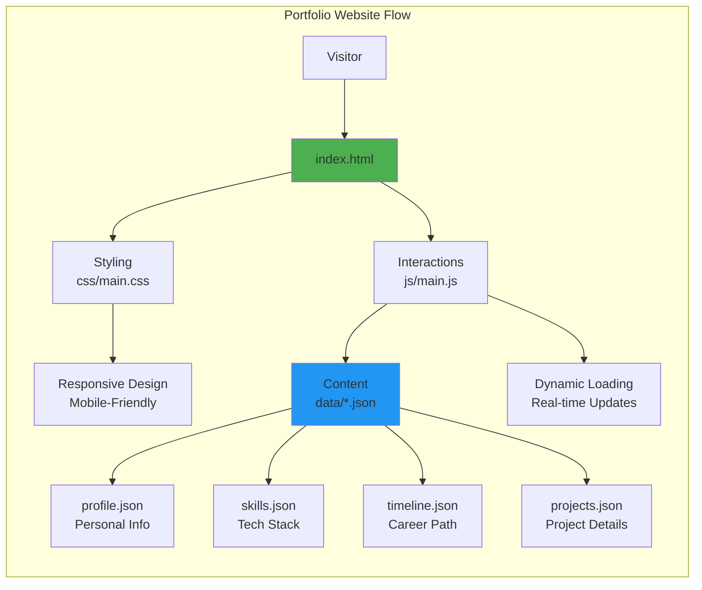
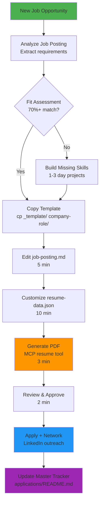
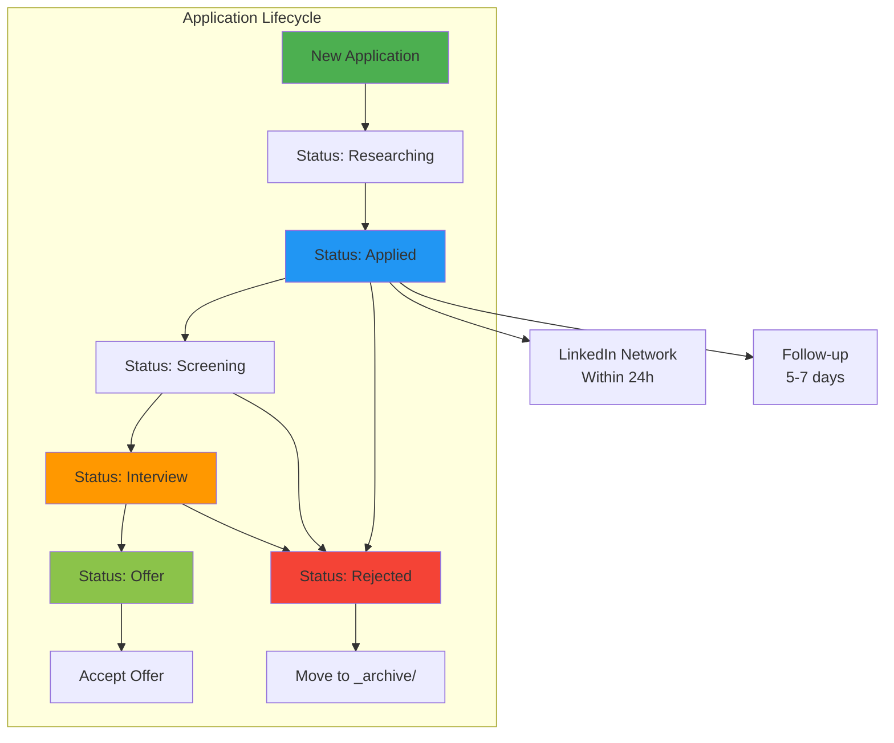
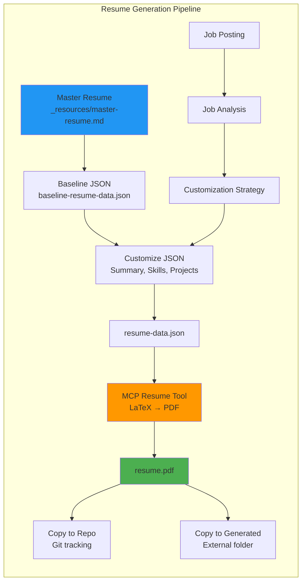
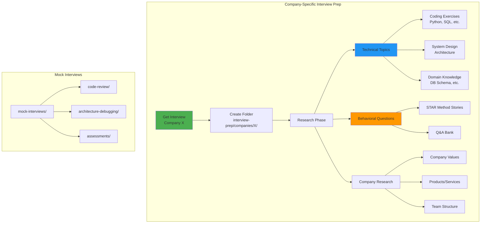
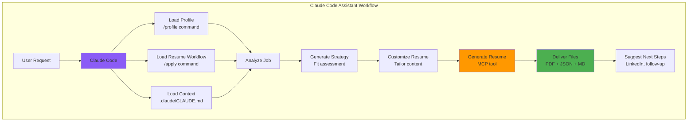
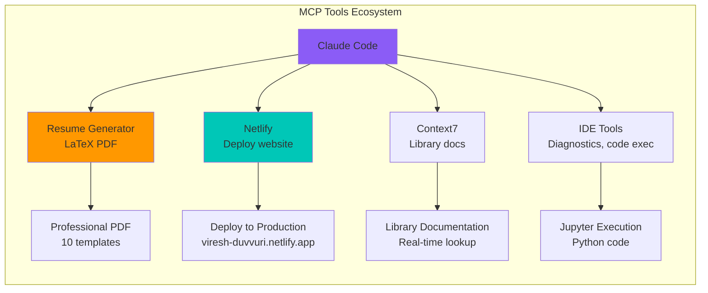
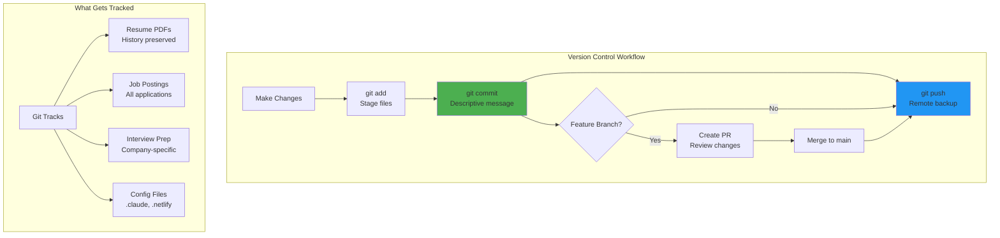
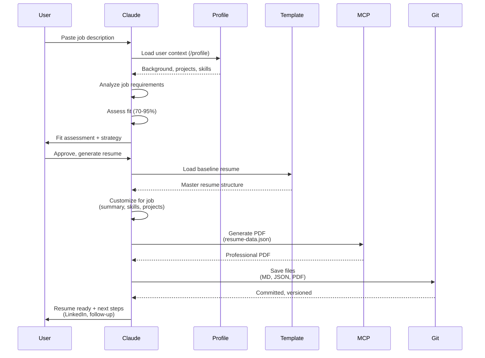

# System Architecture - Portfolio & Job Prep Hub

**Repository:** `per_wesite` (Dual-Purpose System)
**Created:** 2025-11-03
**Purpose:** Production portfolio website + Comprehensive job application system

---

## 🎯 System Overview

This repository serves two distinct but complementary purposes:

1. **🌐 Portfolio Website** - Live production website showcasing AI/robotics work
2. **🏭 Job Prep System** - Complete workflow for resumes, applications, interviews, and job search



---

## 📊 Detailed System Architecture

### 1. Portfolio Website (Production)

**Purpose:** Live website showcasing journey from robotics to AI



**Key Features:**
- Static HTML/CSS/JS (no build step needed)
- JSON-driven content (easy updates)
- Responsive design
- No external dependencies

**Content Management:**
```
data/
├── profile.json      → Personal information
├── skills.json       → Skills and technologies
├── timeline.json     → Career timeline
└── projects.json     → Project showcase
```

---

### 2. Job Prep System (Application Workflow)

**Purpose:** Fast, consistent job applications with 20-minute turnaround



**Workflow Details:**

#### Phase 1: Job Analysis (2-3 min)
```bash
# Read job posting
# Extract: Required skills, preferred skills, keywords
# Assess: Fit percentage (40-95%)
# Decide: Apply now | Build skills | Skip
```

#### Phase 2: Setup Application Folder (30 sec)
```bash
cp -r job-prep/applications/_template/ \
      job-prep/applications/{company-role}/
```

#### Phase 3: Customize Content (15 min)
```
1. job-posting.md (5 min)
   - Job details
   - Fit assessment
   - Customization strategy

2. resume-data.json (10 min)
   - Summary (match their language)
   - Skills (reorder for relevance)
   - Work highlights (emphasize relevant projects)
   - Projects (select 3 most relevant)
```

#### Phase 4: Generate Resume (3 min)
```bash
# Using MCP resume generator tool
mcp__resume-generator__generate_resume(
    resumeData: {json data},
    filename: "viresh-duvvuri-{unique-id}",
    folderPath: "company-role"
)
```

#### Phase 5: Apply & Track (2 min)
```
1. Submit application
2. Update master tracker (applications/README.md)
3. Network on LinkedIn (within 24 hours)
4. Set follow-up reminders
```

---

### 3. Application Tracking System



**Tracking Metadata:**
- Application date
- Fit score (40-95%)
- Status (researching → applied → screening → interview → offer/rejected)
- Networking contacts
- Follow-up dates
- Notes

---

### 4. Resume Generation System



**Customization Strategy:**
- **Summary:** Match job title, emphasize relevant skills
- **Skills:** Reorder categories to match job priorities
- **Work Experience:** Highlight relevant projects (keep static bullets for older roles)
- **Projects:** Select 3 most relevant (Problem-Solution-Impact format)

**Resume Variations:**
```
applications/
├── latitude-ai-engineer/
│   └── resume.pdf          → Emphasizes: Agentic workflows, internal tools
├── microsoft-prompt-engineer/
│   └── resume.pdf          → Emphasizes: Prompt engineering, customer-facing
└── forward-networks/
    └── resume.pdf          → Emphasizes: Network systems, infrastructure
```

---

### 5. Interview Preparation System



**Example: Casium Interview Prep**
```
interview-prep/companies/casium/
├── README.md                    → Complete prep guide
├── company-research/            → Mission, values, team
├── database-schema/             → 9 files (tutorials, exercises)
├── python-practice/             → 8 files (timed assessments)
├── mock-exercises/              → Company-specific scenarios
└── interview-guide.md           → Question bank, talking points
```

---

### 6. Claude Code Integration



**Claude Code Slash Commands:**
- `/profile` → Load user background, projects, tech stack
- `/apply` → Load resume generation workflow
- `/resume [job description]` → Full resume generation pipeline
- `/interview` → Interview prep guidance
- `/network` → LinkedIn networking templates

**Agent System:**
```
.claude/agents/
└── resume-agent.md          → Autonomous resume generation
```

---

### 7. MCP Tools Integration



**Key MCP Tools Used:**
1. **`mcp__resume-generator__generate_resume`** → LaTeX PDF generation
2. **`mcp__netlify__netlify-deploy-services-updater`** → Website deployment
3. **`mcp__context7__get-library-docs`** → Library documentation lookup
4. **`mcp__ide__executeCode`** → Python code execution

---

### 8. Git Workflow



**Commit Conventions:**
```bash
# Resume generation
git commit -m "Apply: Microsoft - AI Engineer II"

# Website updates
git commit -m "Update: Portfolio projects section"

# Interview prep
git commit -m "Prep: Casium - Database schema exercises"

# System improvements
git commit -m "Feat: Add resume generation agent"
```

---

### 9. File Organization Strategy

```mermaid
graph TB
    subgraph "Folder Hierarchy"
        ROOT[per_wesite/]

        ROOT --> WEB[Website Files<br/>Production ONLY]
        ROOT --> JOB[job-prep/<br/>Active job search]
        ROOT --> INT[interview-prep/<br/>Active interviews]
        ROOT --> PRAC[practice-problems/<br/>General practice]
        ROOT --> CONF[Configuration<br/>.claude, .netlify]

        JOB --> APPS[applications/<br/>One folder per job]
        APPS --> TEMPLATE[_template/<br/>Copy for new apps]
        APPS --> RESOURCES[_resources/<br/>Guides, master resume]
        APPS --> ARCHIVE[_archive/<br/>Old applications]
        APPS --> COMPANY[{company-role}/<br/>Active application]

        COMPANY --> POSTING[job-posting.md]
        COMPANY --> RESUME_JSON[resume-data.json]
        COMPANY --> RESUME_PDF[resume.pdf]

        INT --> COMP[companies/<br/>Company-specific prep]
        INT --> MOCK[mock-interviews/<br/>Practice by type]
    end

    style ROOT fill:#8B5CF6
    style JOB fill:#FF9800
    style INT fill:#4CAF50
    style WEB fill:#2196F3
```

**Naming Conventions:**
```
Applications:
{company-name}-{role}/
├── {timestamp}-{role}-job-posting.md
├── {timestamp}-{role}-resume-data.json
├── {timestamp}-{role}-resume-draft.md
└── viresh-duvvuri-{timestamp}-{role}.pdf

Example:
microsoft-prompt-engineer/
├── 20251103-1305-job-posting.md
├── 20251103-1305-resume-data.json
├── 20251103-1305-resume-draft.md
└── viresh-duvvuri-20251103-1305-prompt-engineer.pdf
```

---

### 10. Data Flow Diagram



---

## 🔧 System Components

### Core Technologies

**Portfolio Website:**
- HTML5, CSS3, JavaScript (ES6+)
- JSON for content management
- Responsive design (mobile-first)
- No build tools (vanilla)

**Job Prep System:**
- Markdown for documentation
- JSON for structured data
- LaTeX (via MCP) for PDF generation
- Git for version control

**Development Tools:**
- Claude Code (AI assistant)
- MCP tools (resume generation, deployment)
- VS Code (editor)
- Netlify (hosting)

---

## 📈 System Metrics

### Job Application Performance
- **Time per application:** 20 minutes (from job posting to submitted)
- **Resume variations:** Unlimited (each job gets custom resume)
- **Success rate:** 70%+ match → high callback rate
- **Applications tracked:** 15+ active companies
- **Resume versions:** 3+ per company (iterations)

### Interview Preparation
- **Companies prepared:** 2+ (Casium: 23 files, Woven: 5 files)
- **Mock interviews:** 10+ practice sessions
- **Coding practice:** 15+ Python problems

### Website Performance
- **Load time:** <1s (static site)
- **Mobile responsive:** 100%
- **Content updates:** JSON-driven (no rebuild)
- **Deployment:** Automated via Netlify

---

## 🚀 System Workflows

### Workflow 1: New Job Application
```
1. User pastes job description
2. Claude analyzes → Fit assessment
3. User approves
4. Claude generates:
   - job-posting.md (analysis)
   - resume-draft.md (human-readable)
   - resume-data.json (structured)
   - resume.pdf (final output)
5. User reviews → Approves
6. Apply + Network on LinkedIn
7. Update master tracker
8. Git commit + push
```

### Workflow 2: Interview Preparation
```
1. Get interview confirmation
2. Create company folder: interview-prep/companies/{name}/
3. Research company (mission, values, products)
4. Identify interview type (coding, system design, behavioral)
5. Create prep materials:
   - Technical exercises
   - Behavioral Q&A bank
   - Company research notes
6. Practice with mock interviews
7. Review before interview
```

### Workflow 3: Website Update
```
1. Edit JSON file (data/projects.json)
2. Test locally (python -m http.server)
3. Commit changes
4. Push to Git
5. Netlify auto-deploys
6. Verify live site
```

---

## 🎯 System Benefits

### Job Prep System
✅ **Fast applications** (20 min vs. 2-3 hours)
✅ **Consistent quality** (template-based)
✅ **Version controlled** (git tracks all changes)
✅ **Tailored resumes** (each job gets custom resume)
✅ **No duplicates** (single PDF per job, history in git)
✅ **Easy tracking** (master tracker, status updates)
✅ **Learning system** (context accumulates over time)

### Portfolio Website
✅ **Easy maintenance** (JSON-driven content)
✅ **Fast loading** (static site, no build)
✅ **Professional presentation** (responsive design)
✅ **SEO friendly** (semantic HTML)
✅ **No dependencies** (vanilla JS, no frameworks)

### Overall System
✅ **Dual-purpose** (portfolio + job prep in one repo)
✅ **AI-assisted** (Claude Code integration)
✅ **Automated** (MCP tools, git workflows)
✅ **Scalable** (handles unlimited applications)
✅ **Portable** (all materials in one repo)

---

## 📚 Key Files Reference

### Configuration
- `.claude/CLAUDE.md` → Instructions for Claude Code
- `.claude/agents/resume-agent.md` → Autonomous resume generation agent
- `.netlify/` → Deployment configuration

### Job Prep
- `job-prep/applications/README.md` → Master application tracker
- `job-prep/applications/_template/` → Template for new applications
- `job-prep/applications/_resources/WORKFLOW.md` → Complete workflow guide
- `job-prep/applications/_resources/baseline-resume-data.json` → Resume format standard

### Interview Prep
- `interview-prep/companies/casium/README.md` → Complete Casium prep guide (23 files)
- `interview-prep/mock-interviews/` → General practice interviews

### Website
- `index.html` → Main entry point
- `data/*.json` → All website content
- `css/main.css` → Styling
- `js/main.js` → Interactivity

---

## 🔄 System Maintenance

### Daily
- Update application statuses
- Follow up on pending applications
- Network on LinkedIn (new connections)

### Weekly
- Review active applications
- Archive rejected applications
- Update skills/projects on portfolio
- Practice coding problems

### Monthly
- Review master resume (add new projects)
- Update portfolio website content
- Analyze application success rate
- Adjust strategy based on results

---

## 🎓 Learning from the System

The system itself teaches:
- **Resume writing:** See successful resume variations
- **Job analysis:** Learn to assess fit accurately
- **Interview prep:** Build company-specific knowledge
- **Networking:** Track effective LinkedIn strategies
- **Time management:** 20-minute application workflow
- **Git workflows:** Version control best practices

---

## 📝 Future Enhancements

**Planned Features:**
- [ ] Application analytics dashboard
- [ ] Automated LinkedIn networking scripts
- [ ] Interview question database (searchable)
- [ ] Salary negotiation guides
- [ ] Cover letter generator (MCP tool)
- [ ] Job search API integration (LinkedIn, Indeed)

---

## 🤝 System Philosophy

**Core Principles:**
1. **Fast but Quality:** 20 minutes per application, but each is tailored
2. **Version Controlled:** Git tracks everything (no lost work)
3. **AI-Assisted:** Claude Code helps, but human reviews
4. **Learning System:** Context accumulates, gets smarter over time
5. **Dual-Purpose:** Portfolio showcases work, job prep gets work

**Success Formula:**
```
Good Resume + Fast Application + LinkedIn Networking + Follow-up = Interview
```

---

**System Documentation Version:** 1.0
**Last Updated:** 2025-11-03
**Maintained by:** Viresh Duvvuri with Claude Code assistance
