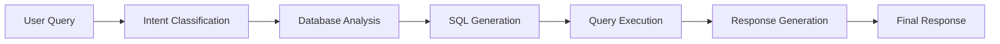
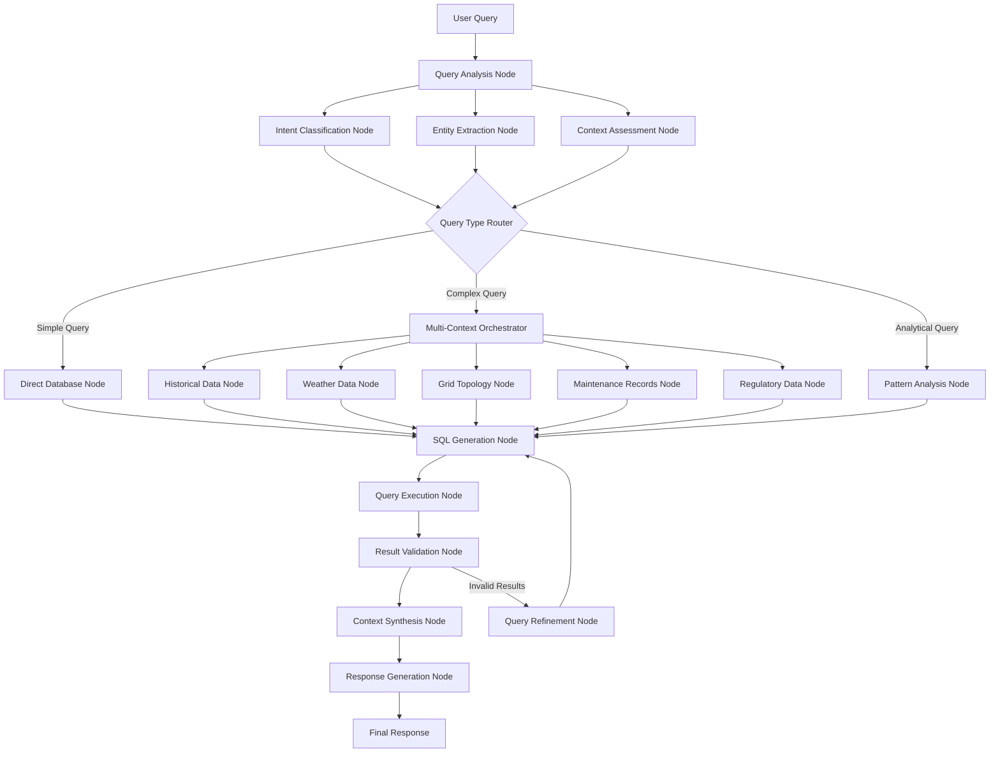

# GridCOP LangGraph Expansion: From Chain to Graph Architecture

## Current State: Linear Chain Implementation



**Current Chain Structure:**
```python
# Current GridCOP Chain (Simplified)
current_chain = (
    intent_router |
    database_adapter |
    query_planner |
    sql_executor |
    response_generator
)
```

---

## Expanded LangGraph Architecture: Multi-Node Context Gathering



## Detailed Node Architecture

### **1. Query Analysis Phase**

#### **Query Analysis Node**
```python
def query_analysis_node(state: GridCOPState) -> GridCOPState:
    """Comprehensive query analysis with multi-dimensional understanding"""
    
    analysis = {
        "complexity": analyze_query_complexity(state["user_query"]),
        "temporal_scope": extract_time_references(state["user_query"]),
        "geographic_scope": extract_location_references(state["user_query"]),
        "technical_domain": classify_technical_domain(state["user_query"]),
        "required_data_sources": identify_data_sources(state["user_query"]),
        "analysis_type": determine_analysis_type(state["user_query"])
    }
    
    return {
        **state,
        "query_analysis": analysis,
        "context_requirements": determine_context_needs(analysis)
    }
```

#### **Entity Extraction Node**
```python
def entity_extraction_node(state: GridCOPState) -> GridCOPState:
    """Extract grid-specific entities and relationships"""
    
    entities = {
        "substations": extract_substations(state["user_query"]),
        "transmission_lines": extract_transmission_lines(state["user_query"]),
        "generators": extract_generators(state["user_query"]),
        "geographic_regions": extract_regions(state["user_query"]),
        "time_periods": extract_time_periods(state["user_query"]),
        "outage_types": extract_outage_classifications(state["user_query"]),
        "weather_events": extract_weather_references(state["user_query"])
    }
    
    return {
        **state,
        "extracted_entities": entities,
        "entity_relationships": map_entity_relationships(entities)
    }
```

### **2. Context Gathering Phase**

#### **Multi-Context Orchestrator**
```python
def multi_context_orchestrator(state: GridCOPState) -> GridCOPState:
    """Orchestrate multiple parallel context gathering operations"""
    
    required_contexts = state["context_requirements"]
    context_tasks = []
    
    # Determine which context nodes to activate
    if required_contexts.get("historical_analysis"):
        context_tasks.append("historical_data_node")
    
    if required_contexts.get("weather_correlation"):
        context_tasks.append("weather_data_node")
    
    if required_contexts.get("grid_topology"):
        context_tasks.append("grid_topology_node")
    
    if required_contexts.get("maintenance_impact"):
        context_tasks.append("maintenance_records_node")
    
    if required_contexts.get("regulatory_compliance"):
        context_tasks.append("regulatory_data_node")
    
    return {
        **state,
        "active_context_nodes": context_tasks,
        "parallel_execution": True
    }
```

#### **Historical Data Node**
```python
def historical_data_node(state: GridCOPState) -> GridCOPState:
    """Gather relevant historical outage and performance data"""
    
    entities = state["extracted_entities"]
    time_scope = state["query_analysis"]["temporal_scope"]
    
    # Query historical patterns
    historical_context = {
        "similar_outages": query_historical_outages(
            substations=entities["substations"],
            time_range=time_scope,
            outage_types=entities["outage_types"]
        ),
        "seasonal_patterns": analyze_seasonal_patterns(
            entities["substations"],
            time_scope
        ),
        "performance_trends": get_performance_trends(
            entities["substations"],
            time_scope
        ),
        "incident_correlations": find_correlated_incidents(
            entities,
            time_scope
        )
    }
    
    return {
        **state,
        "historical_context": historical_context
    }
```

#### **Weather Data Node**
```python
def weather_data_node(state: GridCOPState) -> GridCOPState:
    """Correlate with weather data for enhanced analysis"""
    
    entities = state["extracted_entities"]
    regions = entities["geographic_regions"]
    time_periods = entities["time_periods"]
    
    weather_context = {
        "historical_weather": get_historical_weather(regions, time_periods),
        "severe_events": identify_severe_weather_events(regions, time_periods),
        "weather_outage_correlations": correlate_weather_outages(
            regions, 
            time_periods,
            state.get("historical_context", {}).get("similar_outages", [])
        ),
        "forecast_data": get_weather_forecasts(regions) if is_future_query(state) else None
    }
    
    return {
        **state,
        "weather_context": weather_context
    }
```

#### **Grid Topology Node**
```python
def grid_topology_node(state: GridCOPState) -> GridCOPState:
    """Analyze grid topology and interconnections"""
    
    entities = state["extracted_entities"]
    
    topology_context = {
        "network_topology": get_grid_topology(
            substations=entities["substations"],
            transmission_lines=entities["transmission_lines"]
        ),
        "critical_paths": identify_critical_paths(entities["substations"]),
        "backup_routes": find_backup_transmission_routes(entities["substations"]),
        "load_dependencies": analyze_load_dependencies(entities["substations"]),
        "cascade_risks": assess_cascade_failure_risks(entities["substations"])
    }
    
    return {
        **state,
        "topology_context": topology_context
    }
```

#### **Maintenance Records Node**
```python
def maintenance_records_node(state: GridCOPState) -> GridCOPState:
    """Gather maintenance and asset condition data"""
    
    entities = state["extracted_entities"]
    time_scope = state["query_analysis"]["temporal_scope"]
    
    maintenance_context = {
        "scheduled_maintenance": get_scheduled_maintenance(
            entities["substations"],
            time_scope
        ),
        "completed_maintenance": get_maintenance_history(
            entities["substations"],
            time_scope
        ),
        "asset_conditions": get_asset_condition_assessments(
            entities["substations"]
        ),
        "maintenance_outage_correlations": correlate_maintenance_outages(
            entities,
            time_scope
        ),
        "deferred_maintenance": identify_deferred_maintenance(
            entities["substations"]
        )
    }
    
    return {
        **state,
        "maintenance_context": maintenance_context
    }
```

#### **Regulatory Data Node**
```python
def regulatory_data_node(state: GridCOPState) -> GridCOPState:
    """Include regulatory and compliance context"""
    
    entities = state["extracted_entities"]
    
    regulatory_context = {
        "reliability_standards": get_applicable_reliability_standards(
            entities["geographic_regions"]
        ),
        "compliance_reports": get_recent_compliance_reports(
            entities["substations"]
        ),
        "regulatory_incidents": get_regulatory_incidents(
            entities["substations"]
        ),
        "performance_metrics": get_regulatory_performance_metrics(
            entities["substations"]
        )
    }
    
    return {
        **state,
        "regulatory_context": regulatory_context
    }
```

### **3. Analysis and Synthesis Phase**

#### **Context Synthesis Node**
```python
def context_synthesis_node(state: GridCOPState) -> GridCOPState:
    """Synthesize multiple context sources into coherent analysis"""
    
    # Combine all gathered contexts
    all_contexts = {
        "historical": state.get("historical_context", {}),
        "weather": state.get("weather_context", {}),
        "topology": state.get("topology_context", {}),
        "maintenance": state.get("maintenance_context", {}),
        "regulatory": state.get("regulatory_context", {})
    }
    
    # Cross-context analysis
    synthesis = {
        "primary_factors": identify_primary_contributing_factors(all_contexts),
        "correlations": find_cross_context_correlations(all_contexts),
        "risk_assessment": synthesize_risk_assessment(all_contexts),
        "recommendations": generate_actionable_recommendations(all_contexts),
        "confidence_scores": calculate_analysis_confidence(all_contexts)
    }
    
    return {
        **state,
        "context_synthesis": synthesis,
        "enriched_sql_context": prepare_sql_context(all_contexts, synthesis)
    }
```

#### **Enhanced SQL Generation Node**
```python
def enhanced_sql_generation_node(state: GridCOPState) -> GridCOPState:
    """Generate SQL with rich context integration"""
    
    base_query_info = state["database_query"]
    enriched_context = state["enriched_sql_context"]
    synthesis = state["context_synthesis"]
    
    # Generate context-aware SQL
    enhanced_sql = generate_contextual_sql(
        base_query=base_query_info["sql_query"],
        historical_patterns=enriched_context.get("historical_patterns"),
        weather_correlations=enriched_context.get("weather_correlations"),
        topology_constraints=enriched_context.get("topology_constraints"),
        maintenance_filters=enriched_context.get("maintenance_filters"),
        regulatory_requirements=enriched_context.get("regulatory_requirements")
    )
    
    # Generate multiple query strategies
    query_strategies = [
        {"type": "primary", "sql": enhanced_sql, "confidence": synthesis["confidence_scores"]["primary"]},
        {"type": "fallback", "sql": generate_fallback_sql(base_query_info), "confidence": 0.8},
        {"type": "exploratory", "sql": generate_exploratory_sql(enriched_context), "confidence": 0.6}
    ]
    
    return {
        **state,
        "enhanced_sql_queries": query_strategies,
        "selected_query": query_strategies[0]  # Start with highest confidence
    }
```

## State Management Schema with Safety

```python
from typing import Dict, List, Any, Optional
from pydantic import BaseModel

class GridCOPState(TypedDict):
    # Input
    user_query: str
    session_id: str
    
    # Query Analysis
    query_analysis: Optional[Dict[str, Any]]
    extracted_entities: Optional[Dict[str, List]]
    context_requirements: Optional[Dict[str, bool]]
    
    # Safety and Security
    safety_assessment: Optional[Dict[str, Any]]
    security_validation: Optional[Dict[str, Any]]
    access_permissions: Optional[Dict[str, Any]]
    data_classification: Optional[Dict[str, str]]
    audit_trail: Optional[List[Dict[str, Any]]]
    
    # Context Data
    historical_context: Optional[Dict[str, Any]]
    weather_context: Optional[Dict[str, Any]]
    topology_context: Optional[Dict[str, Any]]
    maintenance_context: Optional[Dict[str, Any]]
    regulatory_context: Optional[Dict[str, Any]]
    
    # Analysis
    context_synthesis: Optional[Dict[str, Any]]
    enriched_sql_context: Optional[Dict[str, Any]]
    
    # Execution
    enhanced_sql_queries: Optional[List[Dict[str, Any]]]
    selected_query: Optional[Dict[str, str]]
    query_results: Optional[Dict[str, Any]]
    
    # Response
    final_response: Optional[str]
    confidence_score: Optional[float]
    
    # Workflow Control
    active_context_nodes: Optional[List[str]]
    parallel_execution: Optional[bool]
    retry_count: Optional[int]
    emergency_stop: Optional[bool]
    safety_violations: Optional[List[str]]
```

## Conditional Routing Logic

```python
def query_type_router(state: GridCOPState) -> str:
    """Route queries based on complexity and requirements"""
    
    analysis = state["query_analysis"]
    
    # Simple factual queries
    if (analysis["complexity"] < 3 and 
        analysis["analysis_type"] == "factual" and
        len(state["extracted_entities"]["substations"]) == 1):
        return "direct_database_node"
    
    # Complex analytical queries requiring multiple contexts
    elif (analysis["complexity"] >= 6 or
          analysis["analysis_type"] in ["causal", "predictive", "comparative"] or
          len(state["extracted_entities"]["substations"]) > 5):
        return "multi_context_orchestrator"
    
    # Pattern analysis queries
    elif (analysis["analysis_type"] == "trend" or
          "pattern" in state["user_query"].lower()):
        return "pattern_analysis_node"
    
    # Default to multi-context for safety
    else:
        return "multi_context_orchestrator"

def context_completion_router(state: GridCOPState) -> str:
    """Route after context gathering completion"""
    
    # Check if all required contexts have been gathered
    required = state["context_requirements"]
    completed = []
    
    if required.get("historical_analysis") and "historical_context" in state:
        completed.append("historical")
    if required.get("weather_correlation") and "weather_context" in state:
        completed.append("weather")
    if required.get("grid_topology") and "topology_context" in state:
        completed.append("topology")
    if required.get("maintenance_impact") and "maintenance_context" in state:
        completed.append("maintenance")
    if required.get("regulatory_compliance") and "regulatory_context" in state:
        completed.append("regulatory")
    
    # If all required contexts gathered, proceed to synthesis
    required_count = sum(1 for v in required.values() if v)
    if len(completed) >= required_count:
        return "context_synthesis_node"
    
    # Otherwise, continue gathering missing contexts
    return "multi_context_orchestrator"
```

## Implementation Example

```python
from langgraph.graph import StateGraph, END

# Create the LangGraph workflow
workflow = StateGraph(GridCOPState)

# Add all nodes
workflow.add_node("query_analysis", query_analysis_node)
workflow.add_node("intent_classification", intent_classification_node)
workflow.add_node("entity_extraction", entity_extraction_node)
workflow.add_node("context_assessment", context_assessment_node)

workflow.add_node("direct_database", direct_database_node)
workflow.add_node("multi_context_orchestrator", multi_context_orchestrator)
workflow.add_node("pattern_analysis", pattern_analysis_node)

workflow.add_node("historical_data", historical_data_node)
workflow.add_node("weather_data", weather_data_node)
workflow.add_node("grid_topology", grid_topology_node)
workflow.add_node("maintenance_records", maintenance_records_node)
workflow.add_node("regulatory_data", regulatory_data_node)

workflow.add_node("context_synthesis", context_synthesis_node)
workflow.add_node("enhanced_sql_generation", enhanced_sql_generation_node)
workflow.add_node("query_execution", query_execution_node)
workflow.add_node("result_validation", result_validation_node)
workflow.add_node("response_generation", response_generation_node)
workflow.add_node("query_refinement", query_refinement_node)

# Set entry point
workflow.set_entry_point("query_analysis")

# Add conditional routing
workflow.add_conditional_edges(
    "context_assessment",
    query_type_router,
    {
        "direct_database_node": "direct_database",
        "multi_context_orchestrator": "multi_context_orchestrator",
        "pattern_analysis_node": "pattern_analysis"
    }
)

# Add parallel context gathering edges
workflow.add_conditional_edges(
    "multi_context_orchestrator",
    lambda state: state["active_context_nodes"],
    {
        "historical_data_node": "historical_data",
        "weather_data_node": "weather_data", 
        "grid_topology_node": "grid_topology",
        "maintenance_records_node": "maintenance_records",
        "regulatory_data_node": "regulatory_data"
    }
)

# Add context completion routing
workflow.add_conditional_edges(
    "historical_data",
    context_completion_router,
    {
        "context_synthesis_node": "context_synthesis",
        "multi_context_orchestrator": "multi_context_orchestrator"
    }
)

# Add similar routing for other context nodes...

# Add error handling and retry logic
workflow.add_conditional_edges(
    "result_validation",
    lambda state: "query_refinement" if not state["query_results"]["valid"] else "response_generation",
    {
        "query_refinement": "query_refinement",
        "response_generation": "response_generation"
    }
)

# Add final edges
workflow.add_edge("response_generation", END)
workflow.add_edge("query_refinement", "enhanced_sql_generation")

# Compile the graph
app = workflow.compile()
```

## Safety-First Architecture Integration

### **Safety Assessment Node**
```python
def safety_assessment_node(state: GridCOPState) -> GridCOPState:
    """Comprehensive safety and security validation before any data access"""
    
    user_query = state["user_query"]
    extracted_entities = state["extracted_entities"]
    
    # Security validation
    security_check = {
        "prompt_injection_detected": check_prompt_injection(user_query),
        "unauthorized_access_attempt": check_unauthorized_patterns(user_query),
        "data_exfiltration_risk": assess_data_exfiltration_risk(extracted_entities),
        "malicious_intent_score": calculate_malicious_intent_score(user_query)
    }
    
    # Data classification assessment
    data_classification = {
        "sensitivity_level": classify_data_sensitivity(extracted_entities),
        "access_level_required": determine_required_access_level(extracted_entities),
        "regulatory_constraints": identify_regulatory_constraints(extracted_entities),
        "export_restrictions": check_export_restrictions(extracted_entities)
    }
    
    # Safety assessment for grid operations
    safety_assessment = {
        "operational_risk": assess_operational_risk(extracted_entities),
        "critical_infrastructure_access": check_critical_infrastructure_access(extracted_entities),
        "emergency_system_query": detect_emergency_system_queries(user_query),
        "safety_constraint_violations": check_safety_constraints(extracted_entities)
    }
    
    # Overall safety determination
    is_safe = (
        not security_check["prompt_injection_detected"] and
        security_check["malicious_intent_score"] < 0.3 and
        safety_assessment["operational_risk"] < 7 and
        not safety_assessment["emergency_system_query"]
    )
    
    return {
        **state,
        "security_validation": security_check,
        "data_classification": data_classification,
        "safety_assessment": safety_assessment,
        "safety_approved": is_safe,
        "audit_trail": [
            {
                "timestamp": datetime.now().isoformat(),
                "action": "safety_assessment_completed",
                "result": "approved" if is_safe else "blocked",
                "details": security_check
            }
        ]
    }
```

### **Access Control and Permission Node**
```python
def access_control_node(state: GridCOPState) -> GridCOPState:
    """Verify user permissions for requested data access"""
    
    session_id = state["session_id"]
    extracted_entities = state["extracted_entities"]
    data_classification = state["data_classification"]
    
    # Get user permissions from session/auth system
    user_permissions = get_user_permissions(session_id)
    
    # Check permissions against data requirements
    access_validation = {
        "user_clearance_level": user_permissions.get("clearance_level"),
        "authorized_regions": user_permissions.get("authorized_regions", []),
        "data_access_rights": user_permissions.get("data_access_rights", []),
        "time_based_restrictions": check_time_based_access(user_permissions)
    }
    
    # Validate access to specific entities
    entity_access_check = {}
    for entity_type, entities in extracted_entities.items():
        for entity in entities:
            entity_access_check[f"{entity_type}_{entity}"] = validate_entity_access(
                entity, entity_type, user_permissions
            )
    
    # Determine permitted data scope
    permitted_entities = filter_permitted_entities(extracted_entities, user_permissions)
    
    # Check for violations
    access_violations = identify_access_violations(extracted_entities, user_permissions)
    
    access_approved = (
        len(access_violations) == 0 and
        access_validation["user_clearance_level"] >= data_classification["sensitivity_level"]
    )
    
    return {
        **state,
        "access_permissions": access_validation,
        "permitted_entities": permitted_entities,
        "access_violations": access_violations,
        "access_approved": access_approved,
        "audit_trail": state["audit_trail"] + [
            {
                "timestamp": datetime.now().isoformat(),
                "action": "access_control_validation",
                "user_id": session_id,
                "result": "approved" if access_approved else "denied",
                "violations": access_violations
            }
        ]
    }
```

### **Data Sanitization and Filtering Node**
```python
def data_sanitization_node(state: GridCOPState) -> GridCOPState:
    """Filter and sanitize query results based on permissions and safety"""
    
    raw_results = state["query_results"]
    permitted_entities = state["permitted_entities"]
    data_classification = state["data_classification"]
    user_permissions = state["access_permissions"]
    
    # Apply data filtering based on permissions
    filtered_results = filter_results_by_permissions(raw_results, permitted_entities)
    
    # Apply data masking for sensitive information
    sanitized_results = apply_data_masking(
        filtered_results, 
        user_permissions["data_access_rights"],
        data_classification["sensitivity_level"]
    )
    
    # Remove or redact sensitive operational details
    operational_sanitized = redact_sensitive_operational_data(
        sanitized_results,
        state["safety_assessment"]["operational_risk"]
    )
    
    # Add safety warnings for critical information
    safety_warnings = generate_safety_warnings(operational_sanitized, state["safety_assessment"])
    
    return {
        **state,
        "sanitized_results": operational_sanitized,
        "safety_warnings": safety_warnings,
        "data_redaction_applied": True,
        "audit_trail": state["audit_trail"] + [
            {
                "timestamp": datetime.now().isoformat(),
                "action": "data_sanitization_completed",
                "redaction_level": data_classification["sensitivity_level"],
                "warnings_added": len(safety_warnings)
            }
        ]
    }
```

### **Emergency Stop and Circuit Breaker**
```python
def emergency_safety_check(state: GridCOPState) -> str:
    """Circuit breaker for emergency safety situations"""
    
    # Check for emergency stop conditions
    emergency_conditions = [
        state.get("safety_assessment", {}).get("emergency_system_query", False),
        state.get("security_validation", {}).get("malicious_intent_score", 0) > 0.8,
        len(state.get("access_violations", [])) > 0,
        state.get("safety_assessment", {}).get("operational_risk", 0) >= 8
    ]
    
    if any(emergency_conditions):
        # Trigger emergency stop
        state["emergency_stop"] = True
        state["safety_violations"] = [
            "Emergency safety condition detected",
            "Query processing terminated for safety"
        ]
        
        # Log emergency stop
        state["audit_trail"].append({
            "timestamp": datetime.now().isoformat(),
            "action": "emergency_stop_triggered",
            "conditions": emergency_conditions,
            "severity": "critical"
        })
        
        return "emergency_response_node"
    
    # Continue normal processing
    return "continue_processing"

def emergency_response_node(state: GridCOPState) -> GridCOPState:
    """Handle emergency stop situations"""
    
    emergency_response = {
        "response": "I cannot process this request due to safety and security constraints.",
        "reason": "Your query has been flagged for potential safety or security risks.",
        "contact": "Please contact your system administrator for assistance.",
        "incident_id": generate_incident_id()
    }
    
    # Notify security team
    notify_security_team(state, emergency_response["incident_id"])
    
    return {
        **state,
        "final_response": emergency_response["response"],
        "emergency_response": emergency_response,
        "workflow_terminated": True
    }
```

## Safety-Enhanced Conditional Routing

```python
def safety_aware_router(state: GridCOPState) -> str:
    """Route queries through safety checkpoints"""
    
    # First check: Emergency stop conditions
    emergency_check = emergency_safety_check(state)
    if emergency_check == "emergency_response_node":
        return "emergency_response_node"
    
    # Second check: Safety assessment completion
    if not state.get("safety_approved", False):
        return "safety_assessment_node"
    
    # Third check: Access control validation
    if not state.get("access_approved", False):
        return "access_control_node"
    
    # Fourth check: Data classification compliance
    if state.get("data_classification", {}).get("sensitivity_level", 0) > 5:
        return "high_security_processing_node"
    
    # Normal processing can continue
    analysis = state["query_analysis"]
    
    if (analysis["complexity"] < 3 and 
        state["safety_assessment"]["operational_risk"] < 3):
        return "direct_database_node"
    elif analysis["complexity"] >= 6:
        return "multi_context_orchestrator"
    else:
        return "standard_processing_node"
```

## Benefits of Safety-Integrated LangGraph Architecture

### **1. Defense-in-Depth Security**
- **Input Validation**: Prompt injection and malicious intent detection
- **Access Control**: User permission validation and entity-level authorization  
- **Data Protection**: Automatic sanitization and redaction based on clearance
- **Audit Trail**: Complete logging of all security decisions

### **2. Operational Safety**
- **Risk Assessment**: Continuous evaluation of operational impact
- **Emergency Stops**: Automatic termination for high-risk queries
- **Circuit Breakers**: Fail-safe mechanisms for critical infrastructure
- **Safety Warnings**: User notification of potential risks

### **3. Regulatory Compliance**
- **Data Classification**: Automatic sensitivity level determination
- **Access Logging**: Comprehensive audit trails for compliance
- **Export Controls**: Automatic restriction enforcement
- **Regulatory Constraints**: Policy-driven access limitations

### **4. Parallel Context Gathering with Safety**
- **Speed**: Multiple context nodes execute simultaneously
- **Security**: Each context node validates its own data access
- **Efficiency**: Only gather contexts that user is authorized to access
- **Scalability**: Easy to add new context sources with built-in safety

### **5. Intelligent Safety-Aware Routing**
- **Risk-Based Routing**: High-risk queries get additional scrutiny
- **Graduated Response**: Different processing paths based on risk level
- **Access-Aware Processing**: Routes based on user permissions
- **Emergency Handling**: Immediate termination for critical safety issues

### **6. Rich Context Integration with Data Protection**
- **Filtered Context**: Only include data user is authorized to see
- **Sanitized Synthesis**: Cross-context analysis with redacted sensitive data
- **Permission-Aware SQL**: Generate queries that respect access controls
- **Safe Response Generation**: Ensure final responses don't leak unauthorized information

## Example Query Flow

**User Query:** *"What caused the outages in the Pacific Northwest during the ice storm last February, and how could we prevent similar cascading failures?"*

**LangGraph Execution:**
1. **Query Analysis**: Identifies causal analysis, geographic scope, temporal scope, weather correlation
2. **Entity Extraction**: Pacific Northwest substations, ice storm, February timeframe
3. **Context Assessment**: Requires historical, weather, topology, maintenance contexts
4. **Parallel Context Gathering**: 
   - Historical data on ice storm outages
   - Weather data for February ice storms
   - Grid topology for cascade analysis
   - Maintenance records for asset vulnerabilities
5. **Context Synthesis**: Correlates weather severity with grid vulnerabilities and cascade patterns
6. **Enhanced SQL**: Generates queries incorporating weather thresholds, topology constraints, and maintenance status
7. **Response Generation**: Comprehensive analysis with prevention recommendations

## Safety-First Flow Example

**User Query:** *"Show me all nuclear plant connections and emergency shutdown procedures"*

**Safety-Enhanced LangGraph Execution:**

### **Step 1: Safety Assessment** 
```python
state = {
    "user_query": "Show me all nuclear plant connections and emergency shutdown procedures",
    "session_id": "user456"
}

# Safety Assessment Node detects high-risk query
state = {
    ...previous state...,
    "safety_assessment": {
        "operational_risk": 9,  # Very high (nuclear infrastructure)
        "critical_infrastructure_access": True,
        "emergency_system_query": True,  # Keywords detected
        "safety_constraint_violations": ["nuclear_plant_access", "emergency_procedures"]
    },
    "security_validation": {
        "malicious_intent_score": 0.7,  # High due to sensitive keywords
        "data_exfiltration_risk": "high"
    },
    "data_classification": {
        "sensitivity_level": 8,  # Classified information
        "regulatory_constraints": ["NERC_CIP", "nuclear_regulations"]
    },
    "safety_approved": False  # Blocked due to high risk
}
```

### **Step 2: Emergency Stop Triggered**
```python
# Safety router detects emergency conditions
emergency_conditions = [
    state["safety_assessment"]["emergency_system_query"] = True,
    state["security_validation"]["malicious_intent_score"] = 0.7 > 0.8 = False,
    state["safety_assessment"]["operational_risk"] = 9 >= 8 = True
]

# Any condition true → Emergency stop
state = {
    ...previous state...,
    "emergency_stop": True,
    "safety_violations": [
        "Emergency safety condition detected",
        "Query processing terminated for safety"
    ],
    "workflow_terminated": True
}
```

### **Step 3: Emergency Response**
```python
# Emergency Response Node handles the situation
state = {
    ...previous state...,
    "final_response": "I cannot process this request due to safety and security constraints.",
    "emergency_response": {
        "reason": "Your query has been flagged for potential safety or security risks.",
        "contact": "Please contact your system administrator for assistance.",
        "incident_id": "INC-2024-001234"
    },
    "audit_trail": [
        {
            "timestamp": "2024-01-07T10:30:00Z",
            "action": "emergency_stop_triggered",
            "conditions": ["operational_risk >= 8", "emergency_system_query"],
            "severity": "critical",
            "incident_id": "INC-2024-001234"
        }
    ]
}

# Security team automatically notified
```

### **Contrast: Safe Query Flow**
**User Query:** *"What was the average outage duration in residential areas last month?"*

```python
# Safety Assessment passes
state = {
    "safety_assessment": {
        "operational_risk": 2,  # Low risk
        "critical_infrastructure_access": False,
        "emergency_system_query": False
    },
    "security_validation": {
        "malicious_intent_score": 0.1,  # Low
        "prompt_injection_detected": False
    },
    "data_classification": {
        "sensitivity_level": 3,  # Public operational data
    },
    "safety_approved": True  # Approved for processing
}

# Normal processing continues with context gathering...
```

## Production Safety Benefits

### **1. Critical Infrastructure Protection**
- **Nuclear Plant Security**: Automatic blocking of queries targeting critical facilities
- **Emergency System Protection**: Detection of queries attempting to access shutdown procedures  
- **Operational Security**: Prevention of operational detail exposure through data analysis

### **2. Insider Threat Mitigation**
- **Privilege Escalation Detection**: Monitoring for access beyond authorized scope
- **Anomalous Query Patterns**: Detection of unusual query behaviors
- **Cross-Reference Validation**: Ensuring queries match job responsibilities

### **3. Regulatory Compliance**
- **NERC CIP Compliance**: Automatic enforcement of reliability standards
- **FERC Requirements**: Built-in regulatory constraint checking
- **Audit Trail Completeness**: Comprehensive logging for regulatory review

### **4. Real-Time Threat Response**
- **Immediate Blocking**: Sub-second response to high-risk queries
- **Escalation Procedures**: Automatic notification of security teams
- **Incident Management**: Integration with security incident response systems

This safety-integrated architecture ensures that GridCOP's enhanced analytical capabilities come with robust protection mechanisms, making it suitable for deployment in critical infrastructure environments where security and safety are paramount.