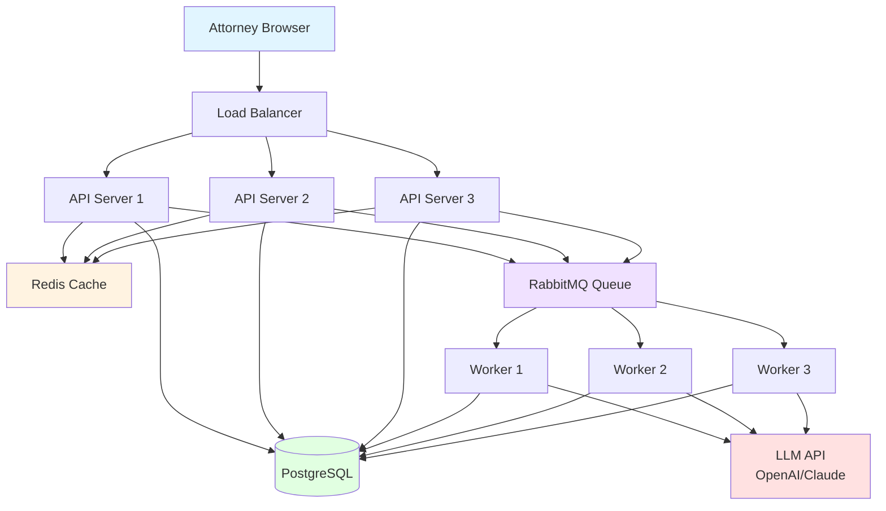
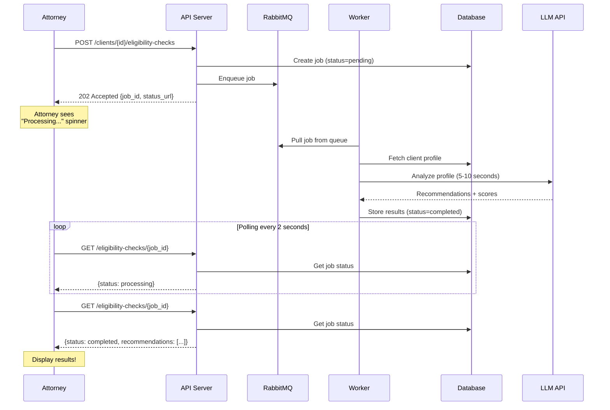
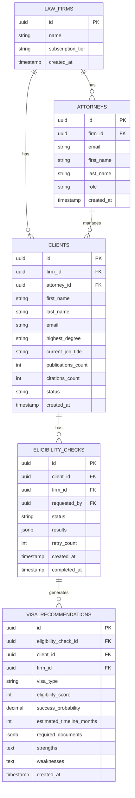
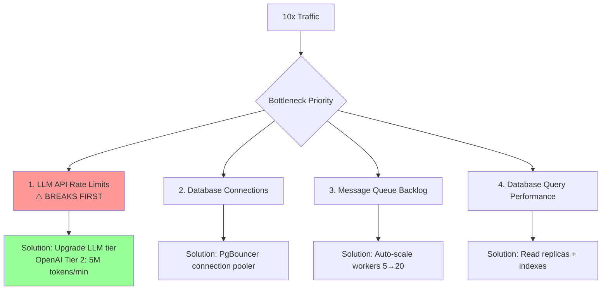
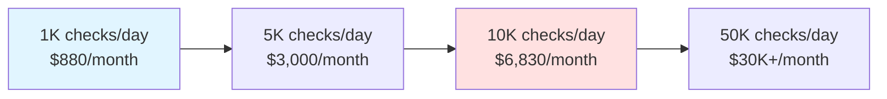
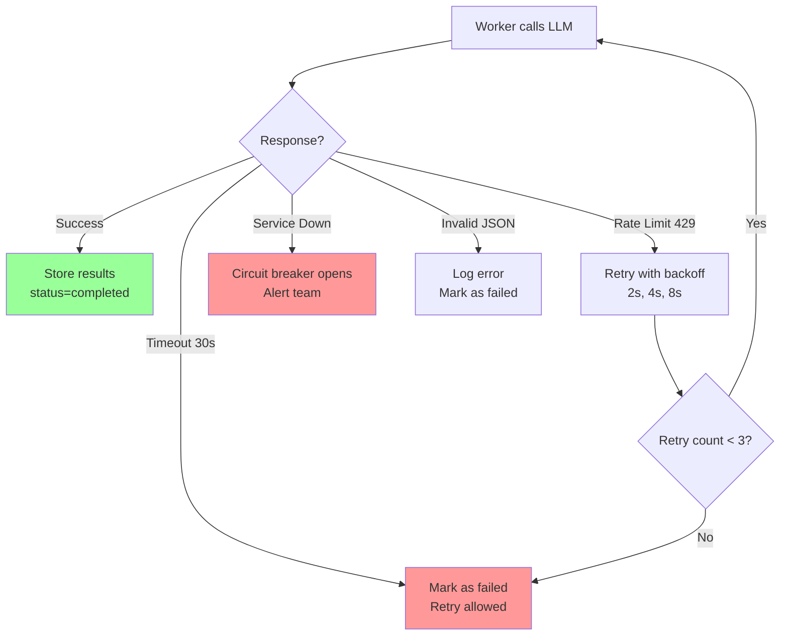
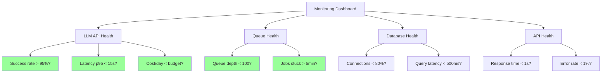

# Visa Eligibility Recommendation System - Complete Solution

**Problem:** Design a system where immigration attorneys input client profiles and get AI-powered visa recommendations.

**Scale:** 150 law firms, 500 attorneys, 50,000 client profiles, 1,000 eligibility checks/day

---

## High-Level Architecture



### Data Flow: Eligibility Check



---

## Database Schema



### Key Tables Explained

**1. law_firms** - Multi-tenancy root
- Every other table has `firm_id` to isolate data

**2. attorneys** - Users of the system
- Linked to one law firm
- Can manage multiple clients

**3. clients** - Visa applicants
- Comprehensive profile (education, work, achievements)
- Belongs to one firm and one attorney

**4. eligibility_checks** - Async job tracking
- Status: pending → processing → completed/failed
- Stores LLM results as JSONB

**5. visa_recommendations** - Parsed LLM results
- Normalized for querying
- One check generates multiple visa options (O-1, H-1B, etc.)

---

## API Design

### Core Endpoints

| Method | Endpoint | Purpose | Response |
|--------|----------|---------|----------|
| POST | `/auth/login` | Attorney login | 200 OK + JWT token |
| GET | `/clients` | List clients (paginated) | 200 OK + client list |
| GET | `/clients/{id}` | Get client profile | 200 OK + full profile |
| POST | `/clients` | Create client | 201 Created |
| PATCH | `/clients/{id}` | Update client | 200 OK |
| POST | `/clients/{id}/eligibility-checks` | **Start eligibility check (ASYNC)** | **202 Accepted** |
| GET | `/eligibility-checks/{id}` | **Poll job status** | 200 OK + status/results |
| GET | `/clients/{id}/eligibility-checks` | List past checks | 200 OK + check history |

### Key API Pattern: Async with 202 Accepted

```json
// Step 1: POST /clients/{id}/eligibility-checks
Response: 202 Accepted
{
  "check_id": "uuid",
  "status": "pending",
  "status_url": "/eligibility-checks/uuid",
  "estimated_completion_seconds": 10
}

// Step 2: Poll GET /eligibility-checks/{check_id}
Response (processing): 200 OK
{
  "check_id": "uuid",
  "status": "processing",
  "progress_percent": 50
}

// Step 3: Poll again after 2 seconds
Response (completed): 200 OK
{
  "check_id": "uuid",
  "status": "completed",
  "recommendations": [
    {
      "visa_type": "O-1A",
      "eligibility_score": 92,
      "success_probability": 85.5,
      "estimated_timeline_months": 4,
      "required_documents": ["CV", "Publications", "Letters of Recommendation"],
      "strengths": "15 publications, 450 citations, PhD from Stanford",
      "weaknesses": "Could benefit from more media coverage"
    }
  ]
}
```

---

## Scaling: What Breaks First?

### Current: 1,000 checks/day
- 2 API servers
- 5 workers
- Single PostgreSQL database
- 2GB Redis cache
- **Cost: $880/month**

### 10x Growth: 10,000 checks/day



### Bottleneck #1: LLM API Rate Limits (FIRST TO BREAK!)

**Problem:**
- OpenAI GPT-4 Tier 1 = 300K tokens/minute
- 50 concurrent checks × 5K tokens = 250K tokens/minute
- At peak, you hit the limit!

**Solution:**
- Upgrade to Tier 2 (5M tokens/min) - $50-100/month additional
- Multi-provider fallback (OpenAI + Claude + Gemini)
- Aggressive caching of results

### Bottleneck #2: Database Connections

**Problem:**
- PostgreSQL default: 100 max connections
- 5 API servers × 15 connections = 75
- 20 workers × 7 connections = 140
- **Total needed: 215 > 100 max!**

**Solution:**
- Use PgBouncer (connection pooler)
- Multiplexes 100 app connections → 20 DB connections
- Or increase `max_connections` to 300

### Scaling Cost



**Key Insight:** ~8x cost for 10x traffic (economies of scale!)

If charging $50/check, profit margin = 98.6%

---

## Multi-Tenancy (CRITICAL!)

### Every table has firm_id

```sql
-- ✅ GOOD: Always filter by firm_id
SELECT * FROM clients
WHERE firm_id = '...' AND id = '...';

-- ❌ BAD: Security vulnerability!
SELECT * FROM clients
WHERE id = '...';  -- Attorney from Firm A could access Firm B's data!
```

### Security Enforcement

```python
# JWT token contains firm_id
@app.get("/clients/{client_id}")
def get_client(client_id: str, attorney: Attorney):
    # MUST verify client belongs to attorney's firm
    client = db.query(Client).filter(
        Client.id == client_id,
        Client.firm_id == attorney.firm_id  # CRITICAL!
    ).first()

    if not client:
        raise HTTPException(404, "Not found")

    return client
```

**Result:** Firm A and Firm B are completely isolated by `firm_id`

---

## Error Handling

### LLM API Failure Scenarios



### Worker Crash Handling

**Problem:** Worker crashes mid-processing → Job lost!

**Solution:** Message acknowledgment

```python
# Worker code
def process_job():
    # 1. Pull job (NOT acknowledged yet)
    job = queue.get(acknowledge=False)

    try:
        # 2. Call LLM
        result = llm_client.create(...)

        # 3. Store results
        db.save(result)

        # 4. ONLY acknowledge after success
        queue.ack(job)

    except Exception as e:
        # 5. NACK → Job goes back to queue
        queue.nack(job, requeue=True)
```

If worker crashes, job becomes visible again after 60 seconds → Another worker picks it up

---

## Monitoring & Alerting

### Key Metrics



**Alert Channels:**
- **PagerDuty** - Critical alerts (wakes on-call engineer)
- **Slack** - Warnings (queue growing)
- **Email** - Daily summaries

---

## Key Takeaways for Your Interview

### 1. Multi-Tenancy is NON-NEGOTIABLE
- Add `firm_id` to EVERY table
- Filter by it in EVERY query
- Casium WILL test this!

### 2. Async Operations for LLM Calls
- Return **202 Accepted** (not 200 OK)
- Use message queue + background workers
- Provide polling endpoint for status

### 3. Database Design Gets 30% Weight
- Spend 15 minutes on this phase
- Show indexes, foreign keys, data types
- Explain relationships

### 4. Identify SPECIFIC Bottlenecks
- Not "the database" → "database connections exceed 100 max"
- Not "add more servers" → "upgrade LLM API tier to 5M tokens/min"
- Show production experience

### 5. Always Explain Trade-offs
- "We could use WebSockets, but polling is simpler for this scale"
- Shows maturity

### 6. Relate to Your Experience
- "Like GridCOP, zero-tolerance for errors → we need validation"
- "Similar to drone tool's RAG → cache LLM results"

---

## Practice Checklist

After studying this solution, you should be able to:

- [ ] Draw high-level architecture in 5 minutes
- [ ] Design database schema in 15 minutes
- [ ] Explain async workflow (11 steps) fluently
- [ ] Design REST API with 202 Accepted
- [ ] Identify LLM API as first bottleneck
- [ ] Calculate costs ($880 → $6,830 for 10x)
- [ ] Explain multi-tenancy with firm_id
- [ ] Show caching strategy
- [ ] Demonstrate error handling
- [ ] Relate to GridCOP and drone tool

**If you can do all of these, you're READY!** 🚀

---

## What to Practice Next

1. **Draw this system on whiteboard** (5 min)
2. **Write schema by hand** (5-7 tables)
3. **Explain async workflow verbally**
4. **Try another mock interview** (different problem)

**Good luck with your Casium interview!** 💪
