# SCALABLE RAG SYSTEM - VISUAL ARCHITECTURE GUIDE
## Interview Prep - Seattle Startup

---

## ORIGINAL QUESTION

**Build a scalable RAG system that:**
- Starts with 100 users, scales to 10K+
- Handles organizational growth (multi-department, multi-tenant)
- Prevents hallucinations and context exhaustion
- Optimizes for cost

---

## SCALING OVERVIEW

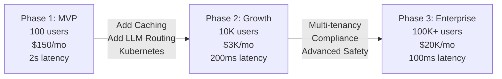

---

## PHASE 1: MVP ARCHITECTURE

### Complete System Flow

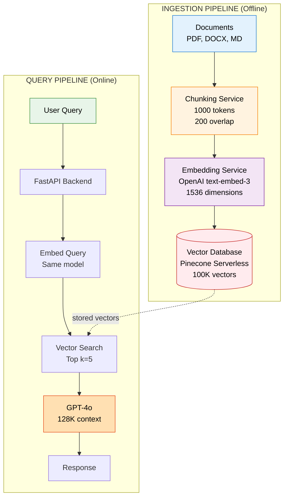

### Key Components

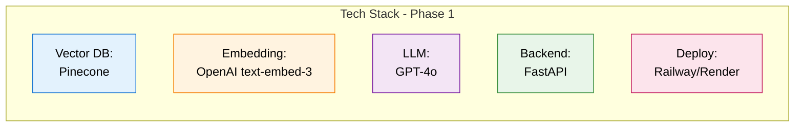

---

## PHASE 2: GROWTH ARCHITECTURE

### System Architecture with Optimizations

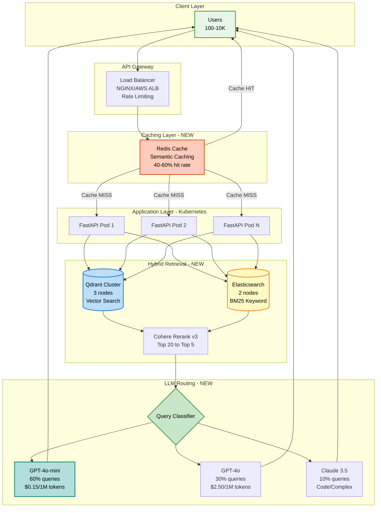

### Query Flow with Caching

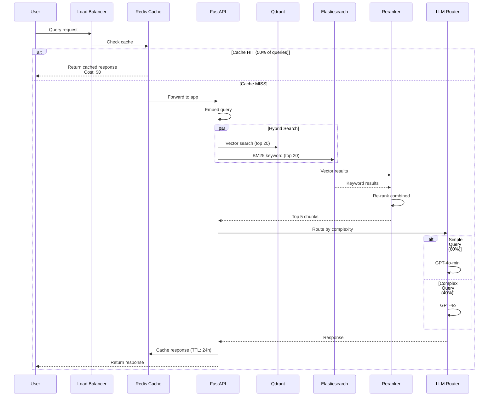

### Cost Optimization Impact

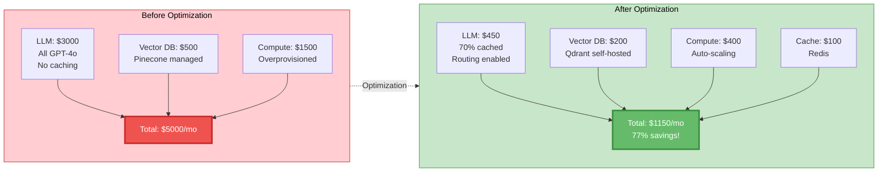

---

## PHASE 3: ENTERPRISE MULTI-TENANT

### Multi-Tenant Architecture

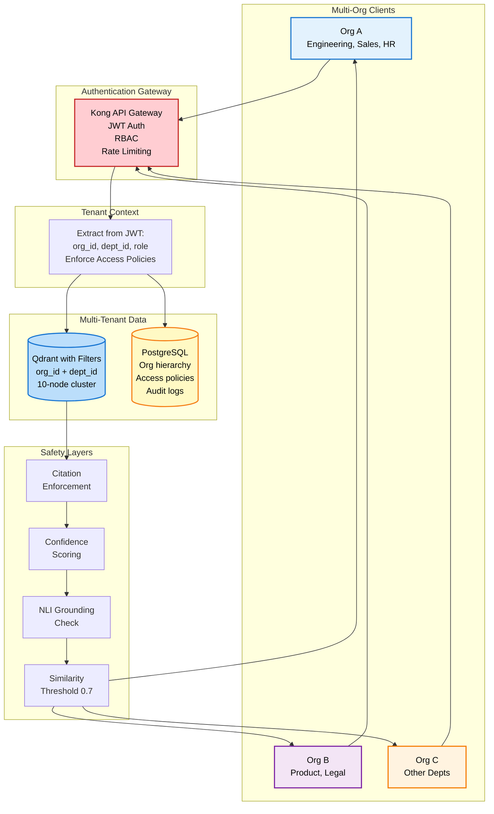

### Multi-Tenant Query Flow with Security

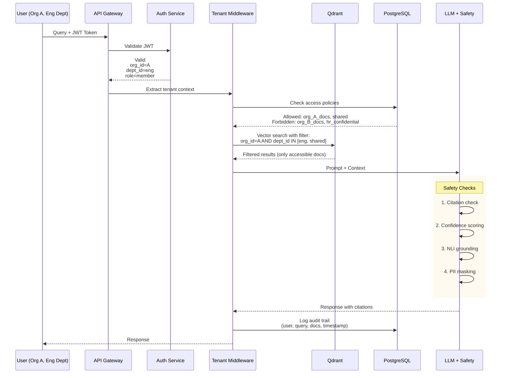

---

## HALLUCINATION PREVENTION

### 4-Layer Defense System

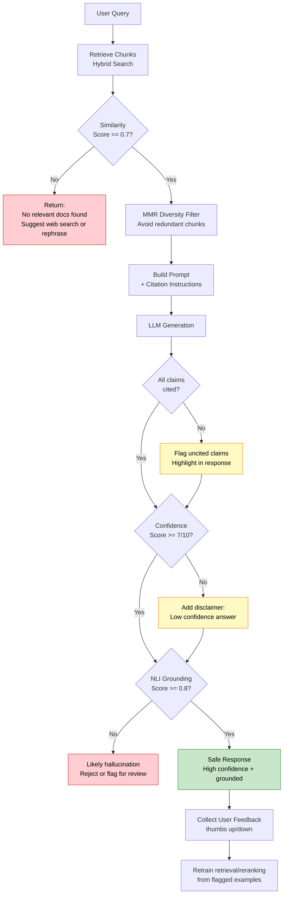

---

## KUBERNETES ROLE

### Auto-Scaling in Action

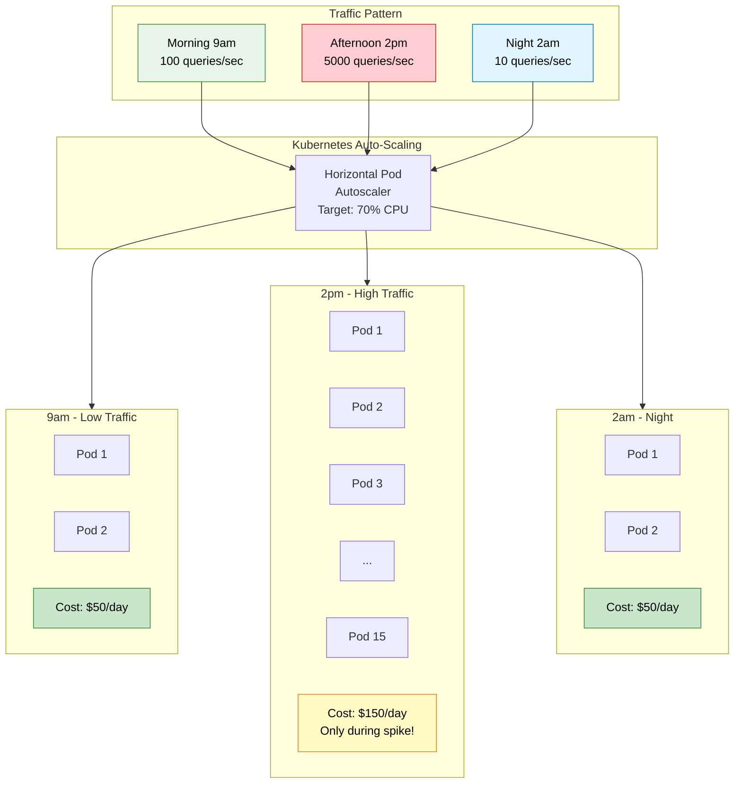

### Kubernetes Benefits

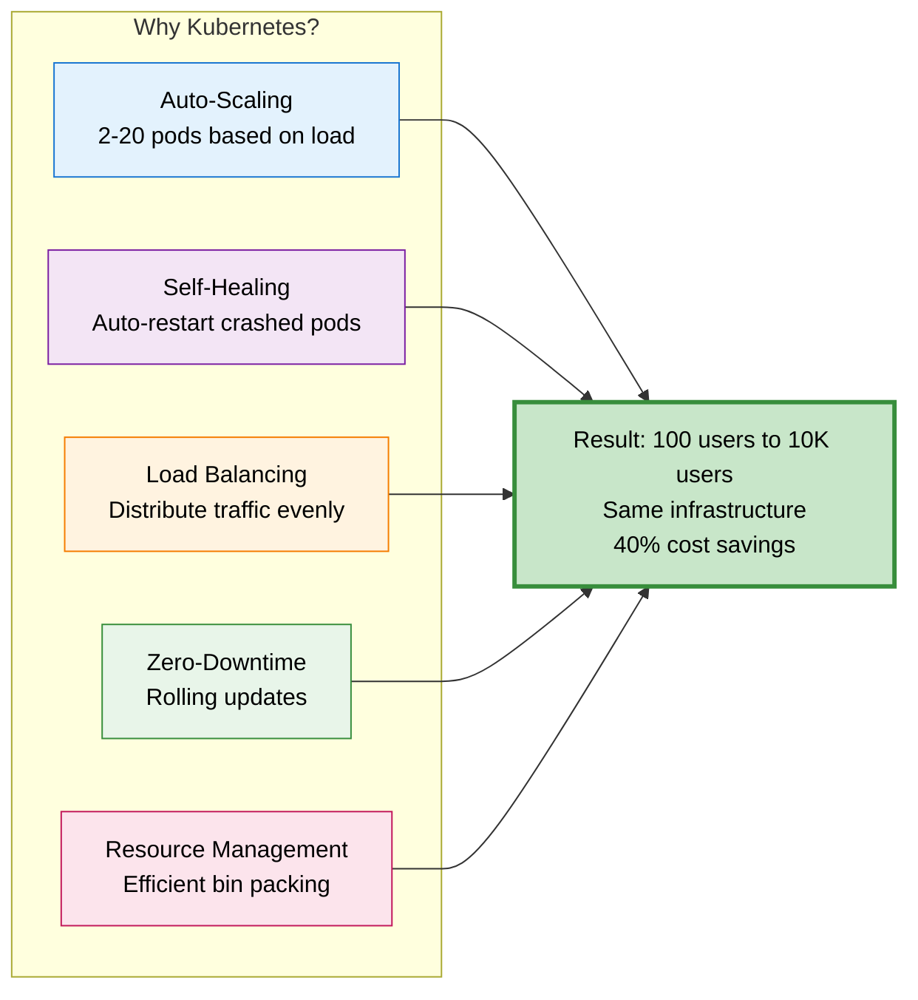

---

## MULTIMODAL RAG

### Multimodal Architecture

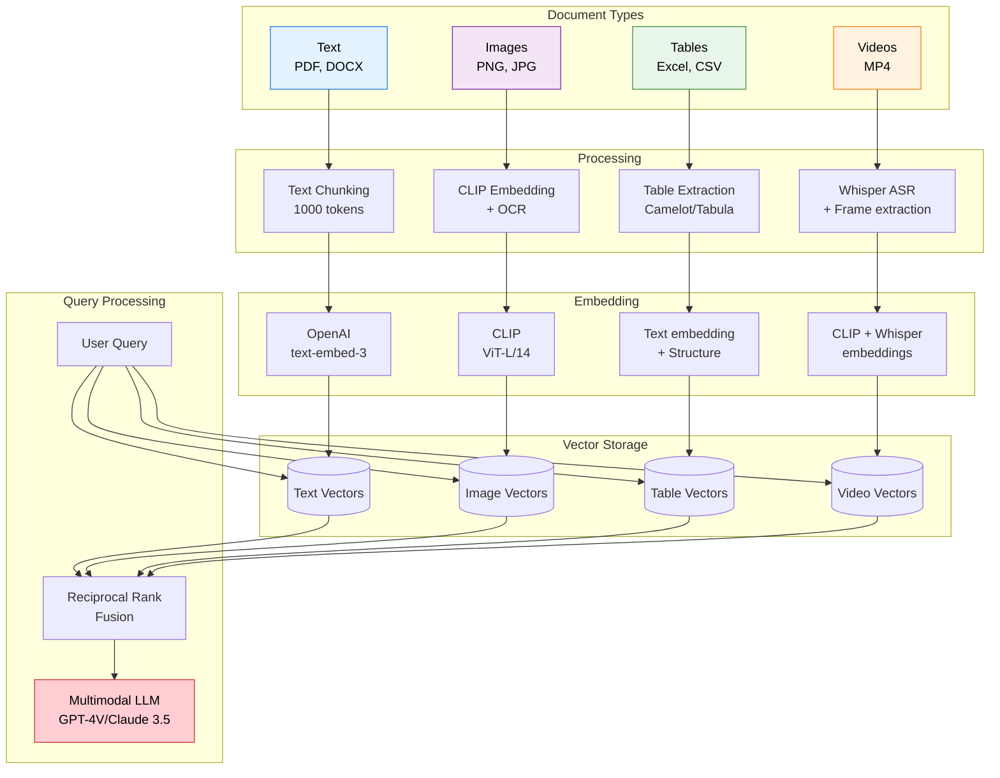

### Multimodal Cost Comparison

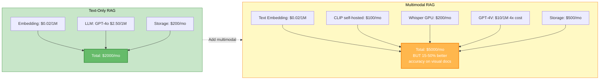

---

## VECTOR DATABASE DECISION TREE

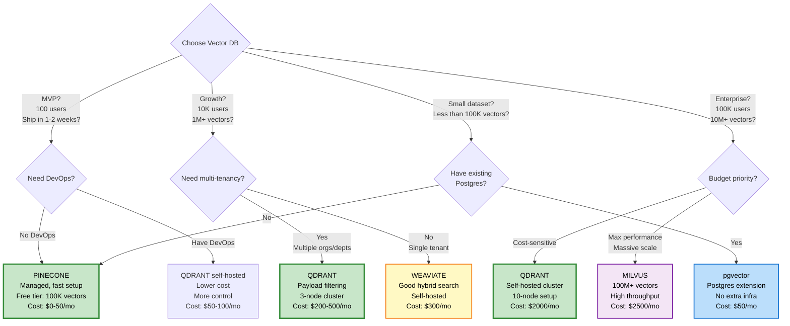

---

## KEY METRICS SUMMARY

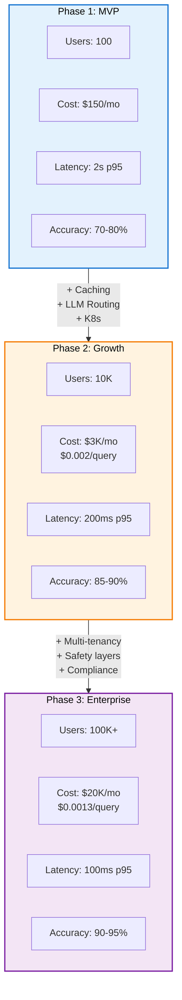

---

## OPTIMIZATION STRATEGIES

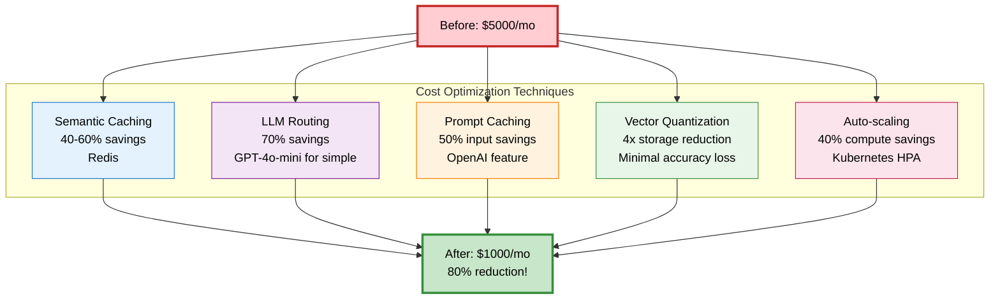

---

## INTERVIEW CHEAT SHEET

### Key Numbers to Remember

| Metric | Phase 1 | Phase 2 | Phase 3 |
|--------|---------|---------|---------|
| Users | 100 | 10K | 100K+ |
| Cost/month | $150 | $3K | $20K |
| Cost/query | $0.005 | $0.002 | $0.0013 |
| Latency p95 | 2s | 200ms | 100ms |
| Accuracy | 70-80% | 85-90% | 90-95% |

### Technology Choices

| Component | Choice | Why? |
|-----------|--------|------|
| Vector DB | Qdrant | Payload filtering for multi-tenancy, open-source, 3x cheaper than Pinecone |
| Embedding | OpenAI text-embed-3 | Industry standard, 1536 dims, $0.02/1M tokens |
| LLM | GPT-4o / GPT-4o-mini | Route by complexity: 60% cheap, 40% quality |
| Cache | Redis | Semantic caching, 40-60% hit rate |
| Compute | Kubernetes | Auto-scaling, self-healing, zero-downtime deploys |

### Optimization Wins

1. **Caching** → 40-60% cost savings
2. **LLM Routing** → 70% savings on LLM calls
3. **Hybrid Search** → 15% accuracy improvement
4. **Vector Quantization** → 4x storage reduction
5. **Auto-scaling** → 40% compute savings

---

**END OF VISUAL GUIDE**
