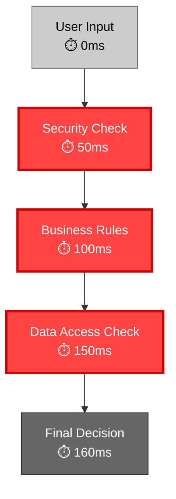
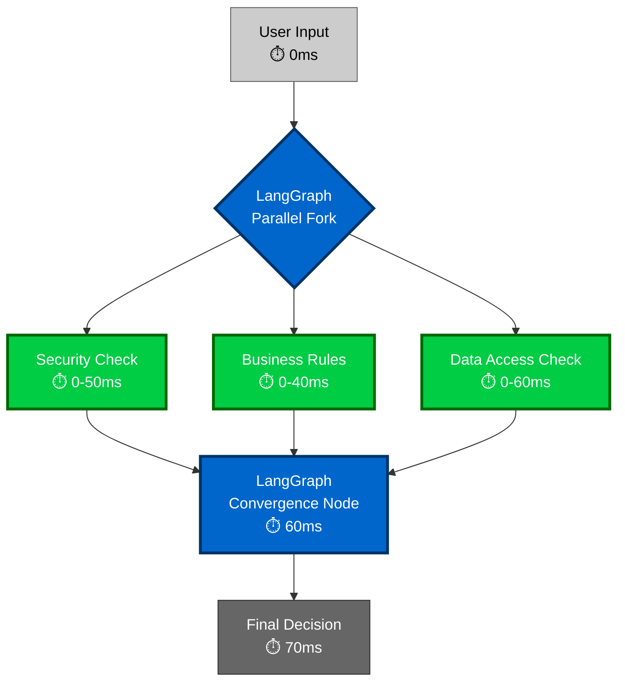
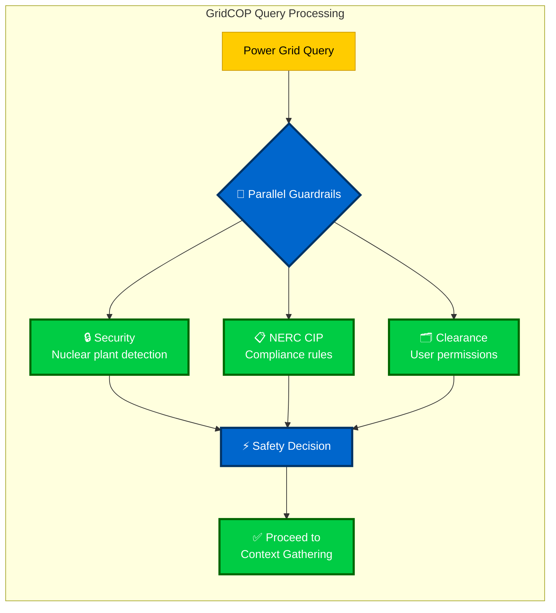
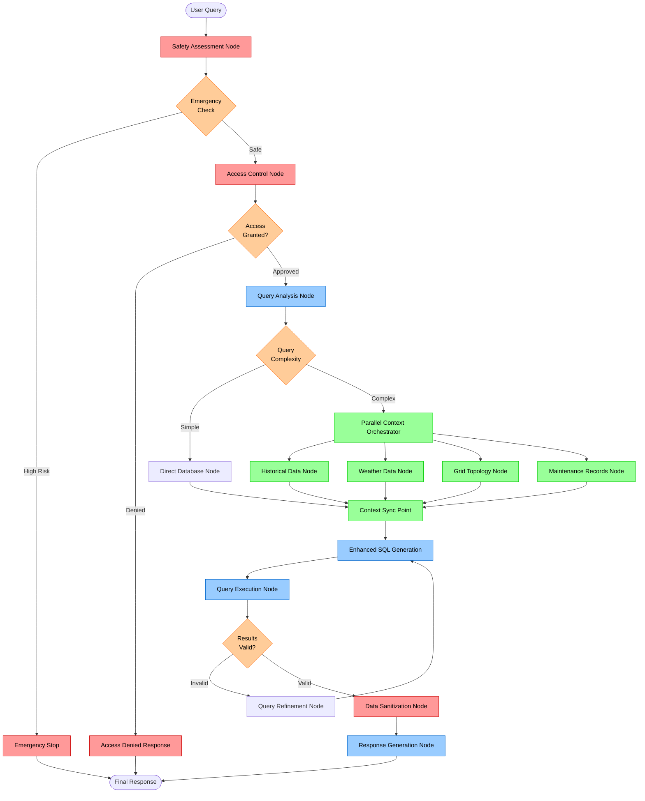
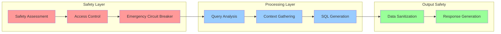
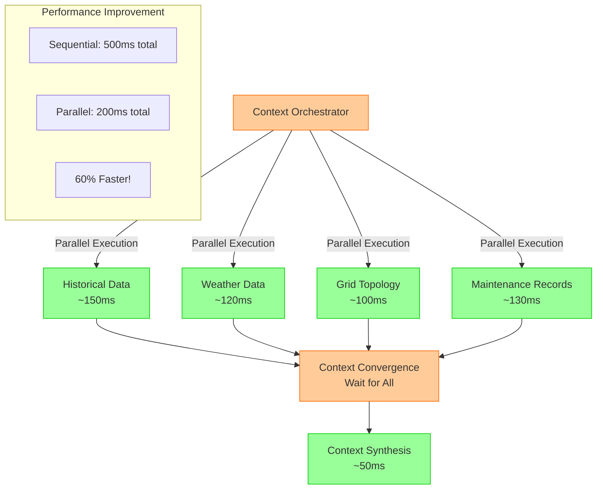

# LangGraph Guardrails Integration: Complete Guide

## 📋 **Quick Overview**

**LangGraph Architecture:**
```
Node A → Edge (with state) → Node B → Edge (with state) → Node C
```

**How Guardrails Fit:**
- **Nodes**: Safety checkpoints that validate and modify state
- **Edges**: Route based on safety decisions  
- **State**: Carries safety information between nodes

---

## 🏗️ **Pattern 1: Dedicated Safety Nodes**

### **Basic Structure**
```
User Input → Safety Validator → Access Control → Main Agent → Output Sanitizer
```

### **State Schema**
```python
class AgentState(TypedDict):
    user_input: str
    safety_approved: bool
    access_granted: bool
    sanitized_output: Optional[str]
    messages: List[BaseMessage]
```

### **Implementation**
```python
from langgraph.graph import StateGraph

workflow = StateGraph(AgentState)

# Add nodes in order
workflow.add_node("safety_validator", safety_validation_node)
workflow.add_node("access_control", access_control_node) 
workflow.add_node("main_agent", main_agent_node)
workflow.add_node("output_sanitizer", output_sanitization_node)

# Safety-aware routing
workflow.add_conditional_edges(
    "safety_validator",
    lambda state: "access_control" if state["safety_approved"] else "rejection_node"
)
```

### **Example Flow**
```python
# Step 1: Initial state
state = {"user_input": "Show me nuclear plant procedures", "safety_approved": False}

# Step 2: Safety validator detects high-risk
state = {"user_input": "...", "safety_approved": False, "violations": ["critical_infrastructure"]}

# Step 3: Conditional edge routes to rejection (never reaches main agent)
```

---

## 🛡️ **Pattern 2: Guard Nodes Between Every Step**

### **Structure**
```
Guard → Process → Guard → Process → Guard
```

### **Implementation**
```python
workflow = StateGraph(AgentState)

# Processing nodes
workflow.add_node("query_analysis", query_analysis_node)
workflow.add_node("data_retrieval", data_retrieval_node)
workflow.add_node("response_generation", response_generation_node)

# Guard nodes (safety checkpoints)
workflow.add_node("pre_analysis_guard", pre_analysis_guard_node)
workflow.add_node("pre_retrieval_guard", pre_retrieval_guard_node)
workflow.add_node("pre_response_guard", pre_response_guard_node)

# Flow with guards between each step
workflow.set_entry_point("pre_analysis_guard")
workflow.add_conditional_edges(
    "pre_analysis_guard",
    lambda state: "query_analysis" if state["guard_passed"] else "EXIT"
)
workflow.add_edge("query_analysis", "pre_retrieval_guard")
# Continue pattern...
```

### **Benefits**
- ✅ **Maximum Safety**: Every step validated
- ✅ **Granular Control**: Can stop at any point
- ❌ **Higher Latency**: More validation overhead

---

## 🔄 **Pattern 3: Integrated Node-Level Validation**

### **Single Node with Built-in Guards**
```python
def safe_agent_node(state: AgentState) -> AgentState:
    # PRE-EXECUTION VALIDATION
    safety_check = validate_action_safety(state["current_action"])
    
    if not safety_check.is_safe:
        return {
            **state,
            "execution_blocked": True,
            "block_reason": safety_check.violation_reason
        }
    
    # MAIN EXECUTION (only if safe)
    execution_result = execute_agent_action(state["current_action"])
    
    # POST-EXECUTION VALIDATION  
    output_validation = validate_output_safety(execution_result)
    
    if not output_validation.is_safe:
        execution_result = sanitize_output(execution_result)
    
    return {
        **state,
        "execution_result": execution_result,
        "execution_blocked": False
    }
```

### **Benefits**
- ✅ **Encapsulated**: Safety logic contained in node
- ✅ **Flexible**: Each node can have different safety rules
- ✅ **Performance**: No extra graph traversal

---

## 🚦 **Conditional Routing with Safety Logic**

### **Safety-Aware Router**
```python
def safety_aware_router(state: AgentState) -> str:
    # Check risk level and route accordingly
    risk_level = state.get("safety_assessment", {}).get("risk_level", 0)
    
    if risk_level >= 8:
        return "emergency_termination"
    elif not state.get("access_granted", False):
        return "access_denied_response"
    elif not state.get("safety_approved", False):
        return "safety_violation_response"
    elif risk_level >= 5:
        return "monitored_execution_node"
    else:
        return "standard_execution_node"

# Use in workflow
workflow.add_conditional_edges(
    "access_control",
    safety_aware_router,
    {
        "emergency_termination": "emergency_termination",
        "access_denied_response": "access_denied_response",
        "monitored_execution_node": "monitored_execution_node",
        "standard_execution_node": "standard_execution_node"
    }
)
```

### **Routing Logic**
1. **Emergency Risk** (8+) → Immediate termination
2. **Access Denied** → Access denied response
3. **Safety Failed** → Safety violation response  
4. **High Risk** (5-7) → Monitored execution with extra logging
5. **Normal Risk** (< 5) → Standard execution

---

## ⚡ **How Parallel Guardrails Actually Work in LangGraph**

### **🔍 The Core Concept**

**Sequential (Current)**: Each guardrail runs one after another
**Parallel (Better)**: Multiple guardrails run simultaneously, then results are combined

### **📊 Sequential vs Parallel Execution - Clear Comparison**

#### **❌ Sequential Execution (Slow)**

**Total Time: 160ms** ❌

#### **✅ Parallel Execution (Fast)**

**Total Time: 70ms** ✅ **56% Faster!**

### **🏗️ How LangGraph Makes This Work**

#### **1. Parallel Node Execution**
```python
# ❌ WRONG: Sequential execution
workflow.add_edge("input", "security_check")
workflow.add_edge("security_check", "business_rules")
workflow.add_edge("business_rules", "data_access")

# ✅ CORRECT: Parallel execution  
workflow.add_edge("input", "security_check")    # All start from same point
workflow.add_edge("input", "business_rules")    # All start from same point
workflow.add_edge("input", "data_access")       # All start from same point
```

#### **2. State Management for Parallel Results**
```python
class GuardRailState(TypedDict):
    user_input: str
    
    # Each guardrail writes to different state keys
    security_result: Optional[Dict[str, Any]]      # Written by security node
    business_rules_result: Optional[Dict[str, Any]] # Written by business rules node
    data_access_result: Optional[Dict[str, Any]]    # Written by data access node
    
    # Final combined result
    overall_safety_approved: Optional[bool]
```

#### **3. Convergence Node Waits for All**
```python
def convergence_node(state: GuardRailState) -> GuardRailState:
    """This node waits until ALL parallel nodes have completed"""
    
    # LangGraph automatically waits until all incoming edges complete
    # before executing this node
    
    security_safe = state["security_result"]["is_safe"]
    business_safe = state["business_rules_result"]["is_safe"] 
    access_safe = state["data_access_result"]["is_safe"]
    
    # Combine results - ALL must pass for overall approval
    overall_safe = security_safe and business_safe and access_safe
    
    return {
        **state,
        "overall_safety_approved": overall_safe
    }
```

### **🎯 Complete Parallel Guardrails Example**

```mermaid
graph TD
    Start([User Query:<br/>"Show me nuclear plant data"]) --> Fork{🔀 LangGraph<br/>Parallel Execution}
    
    %% Parallel Guardrail Nodes
    Fork -->|Edge 1| Security[🔒 Security Guardrail<br/>⏱️ 0-50ms<br/>❌ BLOCKS: Nuclear keywords detected]
    Fork -->|Edge 2| Business[📋 Business Rules<br/>⏱️ 0-40ms<br/>✅ PASS: Query format valid]
    Fork -->|Edge 3| Access[🗂️ Access Control<br/>⏱️ 0-60ms<br/>❌ BLOCKS: Insufficient clearance]
    
    %% Convergence Point
    Security --> Convergence[⚡ Convergence Node<br/>⏱️ 60ms<br/>Waits for ALL parallel nodes]
    Business --> Convergence
    Access --> Convergence
    
    %% Decision Logic
    Convergence --> Decision{🎯 Overall Safety<br/>Security: ❌<br/>Business: ✅<br/>Access: ❌<br/>Result: BLOCK}
    
    Decision -->|Any Failure| Block[🚫 REQUEST BLOCKED<br/>⏱️ 70ms<br/>"Access denied due to security constraints"]
    Decision -->|All Pass| Allow[✅ REQUEST APPROVED<br/>Continue to processing]
    
    %% Styling
    classDef parallel fill:#00cc44,stroke:#006600,stroke-width:3px,color:#fff
    classDef system fill:#0066cc,stroke:#003366,stroke-width:3px,color:#fff
    classDef block fill:#ff4444,stroke:#cc0000,stroke-width:3px,color:#fff
    classDef allow fill:#44cc44,stroke:#226622,stroke-width:3px,color:#fff
    classDef input fill:#ffcc00,stroke:#cc9900,stroke-width:2px,color:#000
    
    class Security,Business,Access parallel
    class Fork,Convergence,Decision system
    class Block block
    class Allow allow
    class Start input
```

### **🔧 Key Implementation Details**

#### **1. How LangGraph Handles Parallel Execution**
```python
from langgraph.graph import StateGraph

workflow = StateGraph(GuardRailState)

# Add all guardrail nodes
workflow.add_node("security_check", security_guardrail_node)
workflow.add_node("business_rules", business_rules_guardrail_node) 
workflow.add_node("access_control", access_control_guardrail_node)
workflow.add_node("convergence", convergence_node)

# 🔥 THE MAGIC: Multiple edges from same source = parallel execution
workflow.add_edge("START", "security_check")    # Fork 1
workflow.add_edge("START", "business_rules")    # Fork 2  
workflow.add_edge("START", "access_control")    # Fork 3

# All parallel nodes feed into convergence
workflow.add_edge("security_check", "convergence")
workflow.add_edge("business_rules", "convergence") 
workflow.add_edge("access_control", "convergence")
```

#### **2. Each Guardrail Node Updates Different State Keys**
```python
def security_guardrail_node(state: GuardRailState) -> GuardRailState:
    # Run security validation
    security_result = validate_security(state["user_input"])
    
    return {
        **state,  # Preserve existing state
        "security_result": security_result  # Add our result
    }

def business_rules_guardrail_node(state: GuardRailState) -> GuardRailState:
    # Run business rules validation  
    business_result = validate_business_rules(state["user_input"])
    
    return {
        **state,  # Preserve existing state
        "business_rules_result": business_result  # Add our result
    }
```

#### **3. Convergence Node Waits Automatically**
```python
def convergence_node(state: GuardRailState) -> GuardRailState:
    """
    LangGraph automatically ensures this node doesn't execute until
    ALL incoming edges (security_check, business_rules, access_control)
    have completed and updated the state.
    """
    
    # By the time this runs, state contains:
    # - security_result (from security_check node)
    # - business_rules_result (from business_rules node)  
    # - access_control_result (from access_control node)
    
    all_results = [
        state["security_result"]["is_safe"],
        state["business_rules_result"]["is_safe"],
        state["access_control_result"]["is_safe"]
    ]
    
    return {
        **state,
        "overall_safety_approved": all(all_results)
    }
```

### **⚡ Performance Benefits**

| Pattern | Security Check | Business Rules | Access Control | Total Time |
|---------|---------------|----------------|----------------|------------|
| **Sequential** | 50ms → | 40ms → | 60ms → | **150ms** |
| **Parallel** | 50ms ↓ | 40ms ↓ | 60ms ↓ | **60ms** |
| | | | | **🚀 60% Faster!** |

### **🎯 Why This Works for GridCOP**



**Result**: GridCOP gets comprehensive safety validation in **minimal time** because all guardrails run simultaneously instead of sequentially!

---

## 📊 **State Evolution Example**

### **Complete Flow with State Changes**

**Step 1: Initial State**
```python
state = {
    "user_query": "What caused the power outage in downtown Seattle?",
    "safety_approved": None,
    "access_granted": None
}
```

**Step 2: After Safety Validation Node**
```python
state = {
    "user_query": "What caused the power outage in downtown Seattle?",
    "safety_approved": True,  # Low-risk query
    "safety_assessment": {
        "risk_level": 3,
        "detected_entities": ["Seattle", "power_outage"], 
        "required_permissions": ["operational_data_read"]
    }
}
```

**Step 3: After Access Control Node**
```python
state = {
    "user_query": "What caused the power outage in downtown Seattle?",
    "safety_approved": True,
    "access_granted": True,  # User has required permissions
    "user_permissions": ["operational_data_read", "public_data_read"],
    "permission_check": {
        "required": ["operational_data_read"],
        "granted": True
    }
}
```

**Step 4: After Main Agent Node**
```python
state = {
    "user_query": "What caused the power outage in downtown Seattle?", 
    "safety_approved": True,
    "access_granted": True,
    "execution_result": {
        "outage_cause": "Equipment failure at Substation 12",
        "affected_customers": 15000,
        "restoration_time": "4 hours"
    }
}
```

---

## 🔧 **Performance Characteristics**

### **Latency by Pattern**

| Pattern | Latency Overhead | Safety Level | Complexity |
|---------|------------------|--------------|------------|
| Dedicated Safety Nodes | 15-25% | High | Low |
| Guard Between Steps | 20-40% | Maximum | Medium |  
| Integrated Validation | 10-15% | Medium | High |
| Parallel Processing | 0-5% | High | High |

### **Real-World Performance**

**From BizGenie VAAS (Production Data):**
- **Validation Time**: ~15ms
- **Execution Time**: ~200ms  
- **Total Overhead**: 7.5%
- **Pattern Used**: Integrated validation

**Projected GridCOP with LangGraph:**
- **Safety Assessment**: 20ms
- **Access Control**: 15ms
- **Parallel Context Gathering**: 300ms
- **Total Time**: 335ms (vs 450ms sequential)
- **Performance Gain**: 25% faster despite safety overhead

---

## 🎯 **Best Practices**

### **1. Choose Right Pattern for Use Case**

**Low Latency Requirements:** 
- Use integrated validation
- Cache validation results
- Parallel processing where possible

**High Security Requirements:**
- Use dedicated safety nodes
- Guard between every step
- Comprehensive audit trails

**Balanced Approach:**
- Dedicated safety nodes for critical checkpoints
- Integrated validation for routine operations
- Parallel processing for expensive validations

### **2. State Management**

**Keep Safety State Minimal:**
```python
# Good: Essential safety info only
safety_state = {
    "safety_approved": True,
    "risk_level": 3,
    "access_granted": True
}

# Bad: Excessive detail
safety_state = {
    "detailed_risk_analysis": {...},  # Large nested objects
    "complete_audit_history": [...],  # Growing arrays
    "cached_validation_results": {...}  # Memory leaks
}
```

**Use Separate Audit Storage:**
- Store detailed audit logs separately
- Keep only essential safety decisions in state
- Reference external audit records by ID

### **3. Error Handling**

**Graceful Degradation:**
```python
def safe_node_with_fallback(state: AgentState) -> AgentState:
    try:
        # Primary safety validation
        validation_result = comprehensive_safety_check(state)
    except Exception:
        # Fallback to basic safety check
        validation_result = basic_safety_check(state)
    
    return {**state, "safety_approved": validation_result.is_safe}
```

---

## 🚀 **Implementation Checklist**

### **Planning Phase**
- [ ] Identify safety requirements and risk tolerance
- [ ] Choose guardrail integration pattern
- [ ] Design state schema with safety fields
- [ ] Plan conditional routing logic

### **Development Phase**  
- [ ] Implement safety validation nodes
- [ ] Add conditional routing based on safety state
- [ ] Create emergency termination paths
- [ ] Add performance monitoring

### **Testing Phase**
- [ ] Test all routing paths (safe and unsafe)
- [ ] Validate emergency termination works
- [ ] Measure performance overhead
- [ ] Test with realistic workloads

### **Production Phase**
- [ ] Monitor safety validation performance
- [ ] Track safety violation patterns
- [ ] Maintain audit trail compliance
- [ ] Optimize based on actual usage patterns

---

## 🏗️ **GridCOP Optimal LangGraph Architecture**

### **Pattern Selection for GridCOP Use Case**

**Best Pattern: Dedicated Safety Nodes + Parallel Context Gathering**

GridCOP's power grid analytics requires:
- **High Security**: Critical infrastructure protection 
- **Performance**: Sub-second query response
- **Regulatory Compliance**: Complete audit trails
- **Rich Context**: Historical + weather + topology data

### **GridCOP-Optimized Architecture Diagram**



### **Why This Pattern Works Best for GridCOP**

#### **1. Safety-First Design**


**Benefits for GridCOP:**
- **Critical Infrastructure Protection**: Automatic blocking of nuclear plant queries
- **Regulatory Compliance**: NERC CIP compliance built-in
- **Defense in Depth**: Multiple safety checkpoints

#### **2. Parallel Context Gathering**


**Benefits for GridCOP:**
- **60% Faster**: Context gathering in parallel vs sequential
- **Rich Analysis**: Multiple data sources for comprehensive insights  
- **Scalable**: Easy to add new context sources
- **Fault Tolerant**: Missing context doesn't break entire query

#### **3. Smart Conditional Routing**
```mermaid
graph TD
    Query[Query Analysis] --> Risk{Risk<br/>Assessment}
    
    Risk -->|Low Risk<br/>Simple Query| Fast[Fast Path<br/>Direct Database]
    Risk -->|Medium Risk<br/>Complex Analysis| Standard[Standard Path<br/>Multi-Context]
    Risk -->|High Risk<br/>Critical Infrastructure| Secure[Secure Path<br/>Enhanced Validation]
    Risk -->|Emergency<br/>Safety Violation| Emergency[Emergency Stop]
    
    Fast --> |~100ms| Response[Response]
    Standard --> |~300ms| Response
    Secure --> |~500ms| Response
    Emergency --> |~10ms| SafeResponse[Safety Response]
    
    classDef fast fill:#99ff99,stroke:#00cc00
    classDef standard fill:#99ccff,stroke:#0066cc
    classDef secure fill:#ffcc99,stroke:#ff6600
    classDef emergency fill:#ff9999,stroke:#cc0000
    
    class Fast,Response fast
    class Standard,Query standard  
    class Secure secure
    class Emergency,SafeResponse emergency
```

**Benefits for GridCOP:**
- **Performance Optimization**: Fast path for simple queries
- **Security Scaling**: More validation for riskier queries
- **Resource Efficiency**: Don't over-process simple requests
- **Emergency Response**: Immediate blocking of dangerous queries

#### **4. State Evolution Through Workflow**
```mermaid
graph LR
    subgraph "Initial State"
        S1[user_query: 'power outage Seattle'<br/>safety_approved: null<br/>access_granted: null]
    end
    
    subgraph "After Safety"
        S2[user_query: 'power outage Seattle'<br/>safety_approved: true<br/>risk_level: 3<br/>access_granted: null]
    end
    
    subgraph "After Access Control"
        S3[user_query: 'power outage Seattle'<br/>safety_approved: true<br/>risk_level: 3<br/>access_granted: true<br/>permitted_entities: ['Seattle_substations']]
    end
    
    subgraph "After Context Gathering"
        S4[user_query: 'power outage Seattle'<br/>safety_approved: true<br/>access_granted: true<br/>historical_context: {...}<br/>weather_context: {...}<br/>topology_context: {...}]
    end
    
    S1 --> S2 --> S3 --> S4
    
    classDef state fill:#e6f3ff,stroke:#0066cc
    class S1,S2,S3,S4 state
```

### **GridCOP Implementation Advantages**

#### **1. Production-Ready Reliability**
- **Circuit Breakers**: Prevent cascade failures in grid analysis
- **Graceful Degradation**: Partial results when some context unavailable
- **Audit Compliance**: Complete decision trail for regulatory review
- **Session Isolation**: Multiple analysts can work simultaneously

#### **2. Security for Critical Infrastructure**
- **Multi-Layer Validation**: Safety → Access → Data → Output
- **Risk-Based Routing**: High-risk queries get additional scrutiny
- **Emergency Stops**: Immediate blocking of dangerous operations
- **Data Classification**: Automatic sensitivity assessment and filtering

#### **3. Performance Despite Safety**
- **Parallel Processing**: Context gathering doesn't slow overall workflow
- **Intelligent Caching**: Repeated safety validations use cached results  
- **Fast Path Routing**: Simple queries bypass expensive validation
- **Optimized State**: Minimal state transfer between nodes

#### **4. Scalability and Maintainability**
- **Modular Design**: New context sources integrate easily
- **Clear Separation**: Safety logic separate from business logic
- **Testable Components**: Each node can be tested independently
- **Configuration Driven**: Safety rules configurable without code changes

## 🎯 **Key Takeaways**

### **LangGraph + Guardrails = Powerful Combination**

1. **Nodes** act as discrete safety checkpoints
2. **Edges** make routing decisions based on safety state  
3. **State** carries safety context through entire workflow
4. **Parallel processing** minimizes performance impact
5. **Conditional routing** enables sophisticated safety policies

### **Main Benefits**

- **Flexible**: Easy to add/remove safety checks
- **Performant**: Parallel validation minimizes latency  
- **Auditable**: Complete safety decision trail in state
- **Scalable**: New safety nodes integrate seamlessly
- **Production-Ready**: Handles errors and edge cases gracefully

### **Perfect for Physical AI Systems**

This architecture is ideal for Grafton Sciences because:
- **Safety-Critical**: Multiple validation layers for physical systems
- **Flexible Routing**: Different safety levels for different operations
- **Audit Requirements**: Complete traceability for regulatory compliance
- **Performance**: Minimal overhead despite comprehensive safety

The LangGraph guardrails integration transforms safety from an afterthought into a **first-class architectural component**.