# System Diagrams & Flowcharts

**Last Updated:** 2025-11-04

This document contains visual diagrams explaining the system architecture, workflows, and technology decisions.

---

## Table of Contents

1. [Current vs Target Architecture](#current-vs-target-architecture)
2. [Workflow Comparison](#workflow-comparison)
3. [Technology Decision Tree](#technology-decision-tree)
4. [Phase Implementation Flow](#phase-implementation-flow)
5. [Token Flow Analysis](#token-flow-analysis)
6. [Data Flow Diagrams](#data-flow-diagrams)

---

## Current vs Target Architecture

### Current System (Before Optimization)

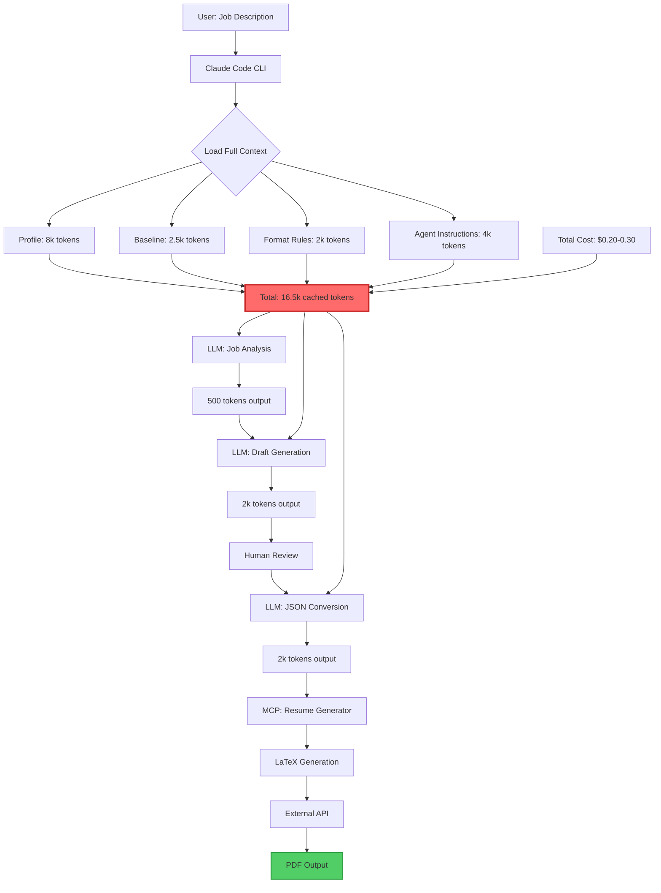

### Target System (After Optimization)

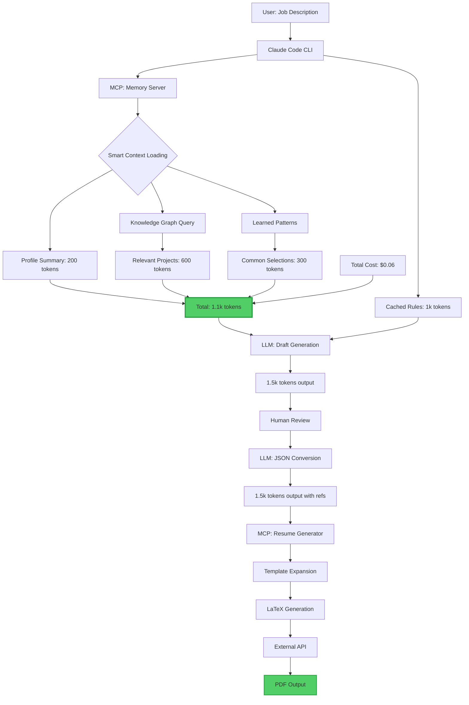

---

## Workflow Comparison

### Before: Multi-Step Resume Generation

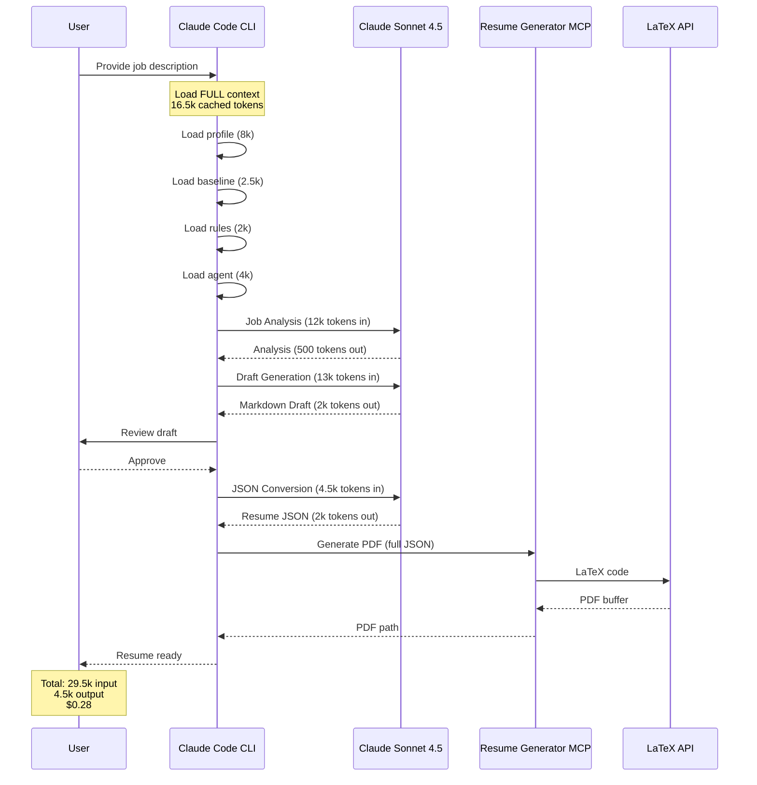

### After: Optimized Resume Generation

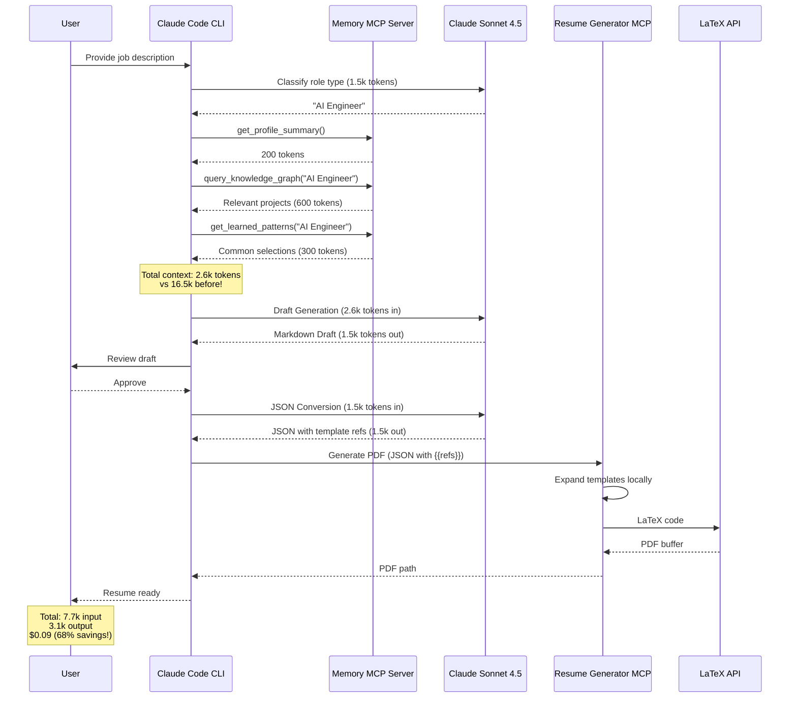

---

## Technology Decision Tree

### Why We Chose Each Tool

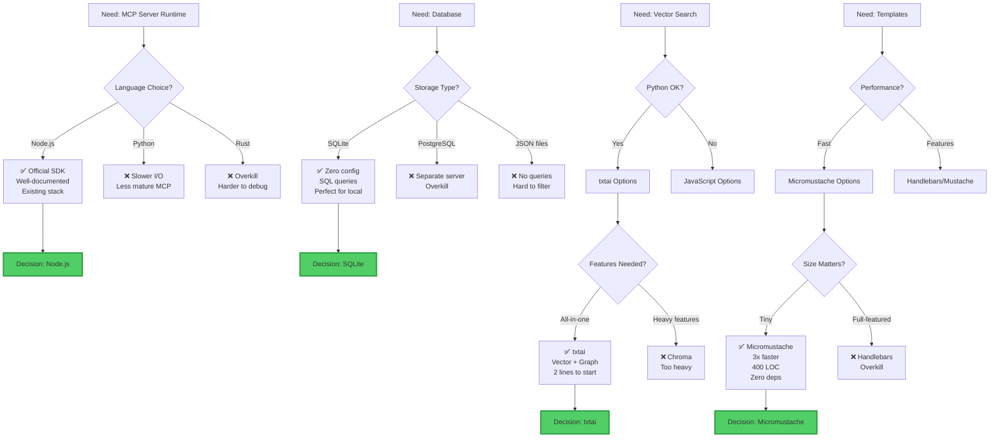

### Technology Selection Matrix

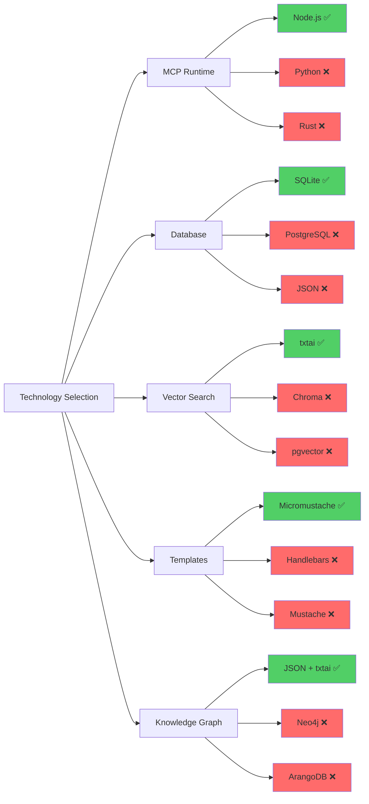

---

## Phase Implementation Flow

### 3-Phase Implementation Strategy

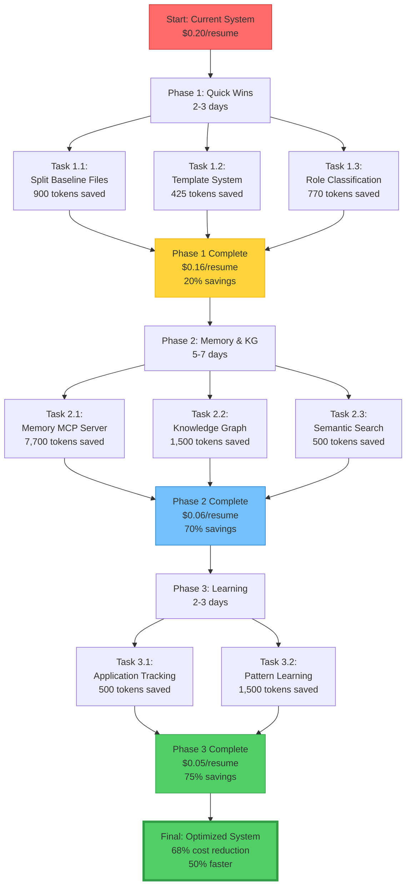

### Implementation Timeline

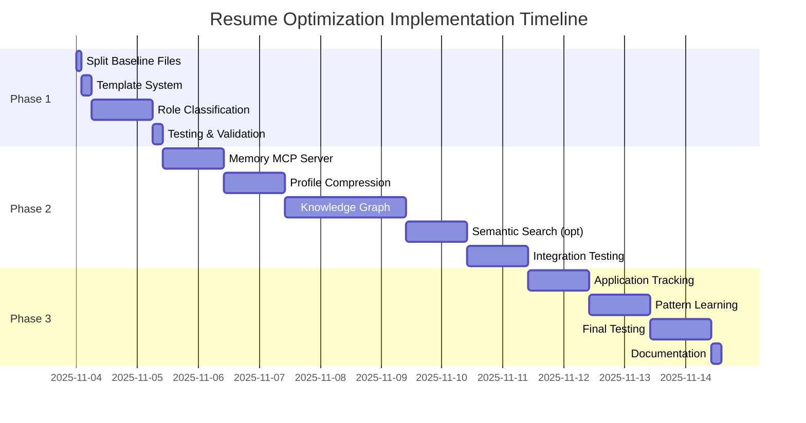

---

## Token Flow Analysis

### Token Reduction by Phase

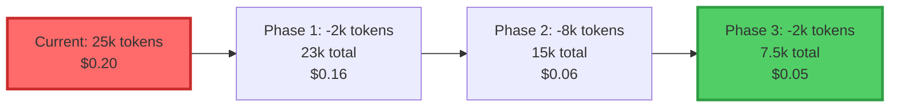

### Token Breakdown (Before vs After)

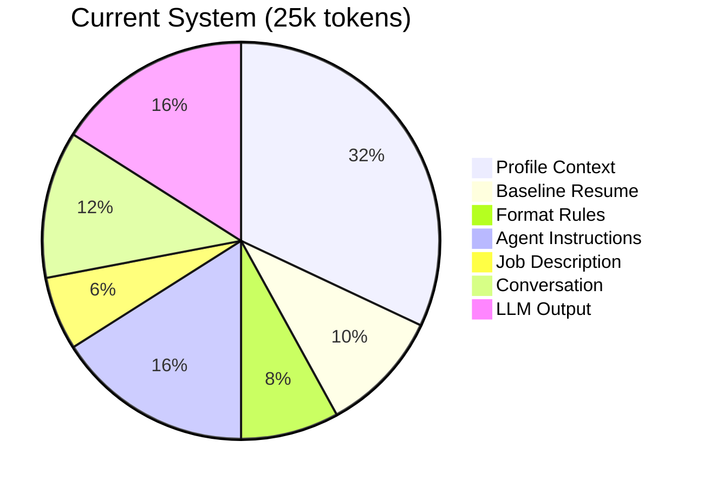

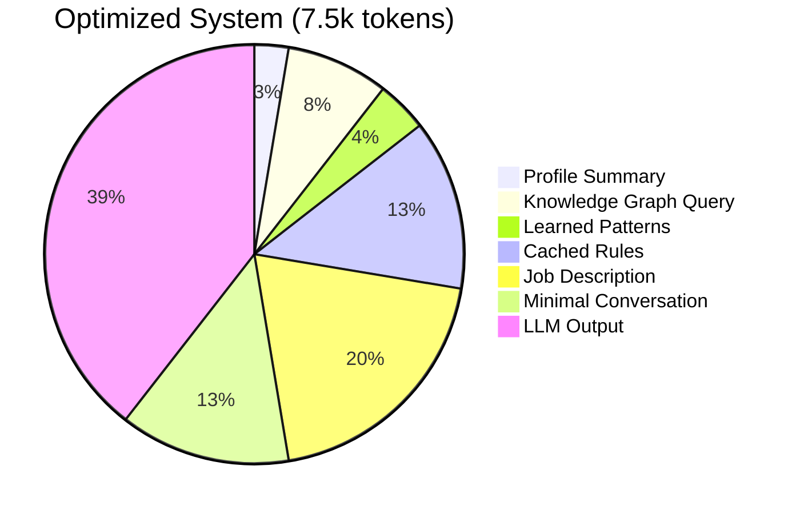

---

## Data Flow Diagrams

### Memory Server Architecture

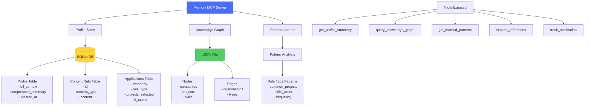

### Knowledge Graph Structure

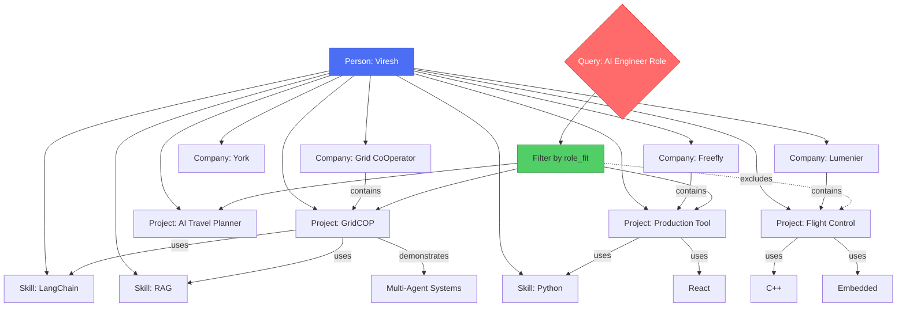

### Template Expansion Flow

```mermaid
graph LR
    A[LLM generates JSON<br/>with template refs] --> B{Contains {{refs}}?}

    B -->|Yes| C[MCP Server:<br/>Template Expander]
    B -->|No| D[Pass through]

    C --> E[Parse template IDs]
    E --> F{Template Registry}

    F --> G[{{lumenier-1}}]
    F --> H[{{york-2}}]
    F --> I[{{freefly_locked-3}}]

    G --> J[Expand to full text:<br/>'Wrote embedded code...']
    H --> K[Expand to full text:<br/>'Built Human Machine...']
    I --> L[Expand to full text:<br/>'Led release management...']

    J --> M[Final JSON with<br/>expanded content]
    K --> M
    L --> M
    D --> M

    M --> N[LaTeX Generator]
    N --> O[PDF Output]

    style C fill:#4c6ef5,stroke:#364fc7,color:#fff
    style F fill:#ffd43b,stroke:#fab005
    style O fill:#51cf66,stroke:#2f9e44
```

---

## Architecture Comparison Chart

### Component Comparison

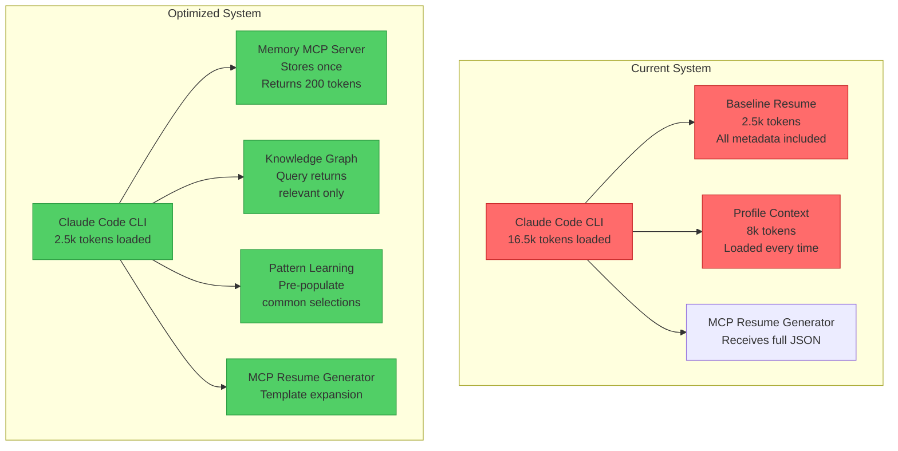

---

## Cost Analysis Visualization

### Cost Breakdown by Phase


### ROI Timeline

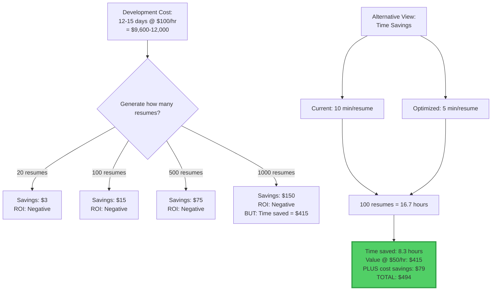

---

## Decision Matrix

### Why Each Technology Choice

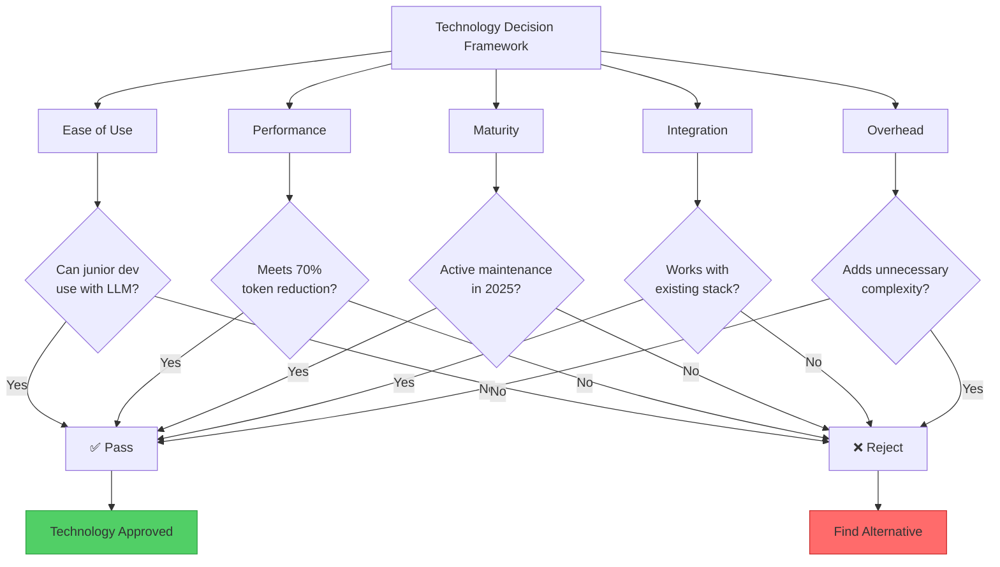

---

## How to View These Diagrams

### In VS Code
1. Install "Markdown Preview Mermaid Support" extension
2. Open this file and press `Ctrl+Shift+V` (or `Cmd+Shift+V` on Mac)
3. Diagrams will render inline

### Online
1. Copy any diagram code block
2. Paste into [Mermaid Live Editor](https://mermaid.live)
3. View and export as PNG/SVG

### In Documentation
These diagrams are written in Mermaid syntax and can be:
- Rendered in GitHub/GitLab README files
- Embedded in documentation sites (Docusaurus, VitePress, etc.)
- Exported as images for presentations

---

**Last Updated:** 2025-11-04
**Version:** 1.0
**Format:** Mermaid.js diagrams
