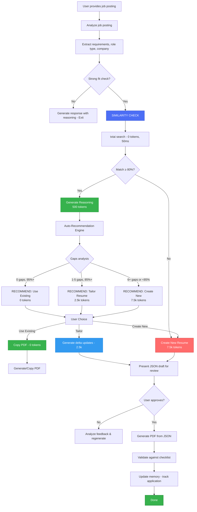
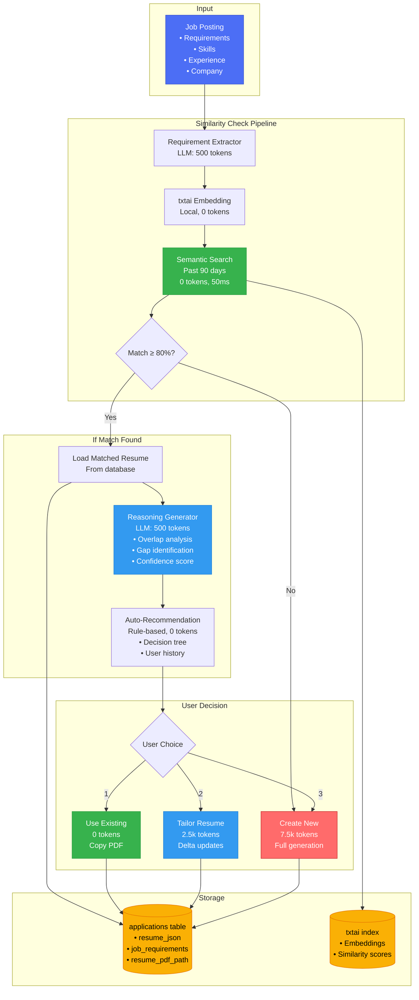
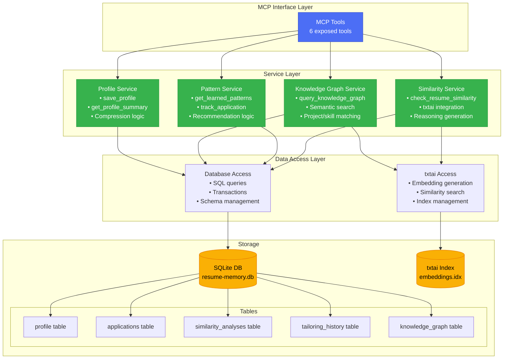
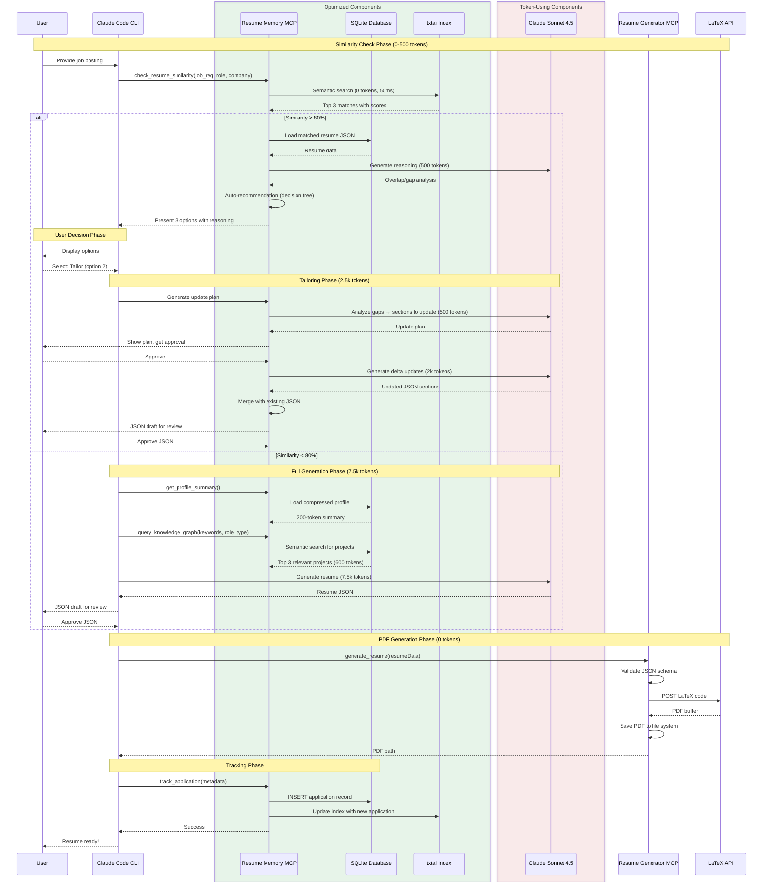
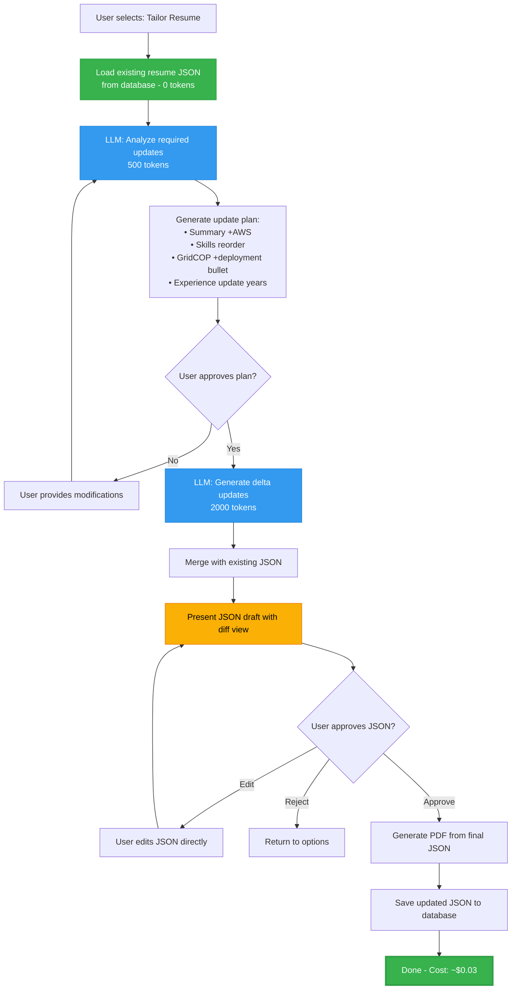
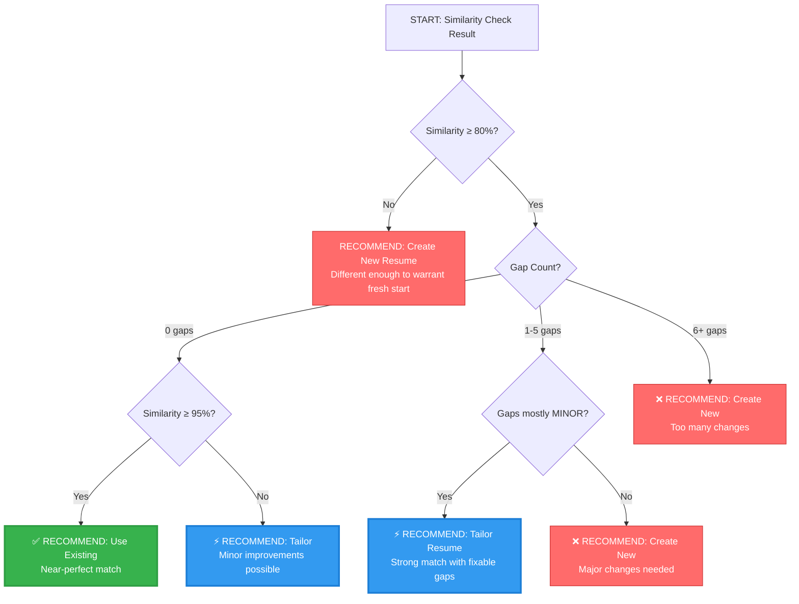
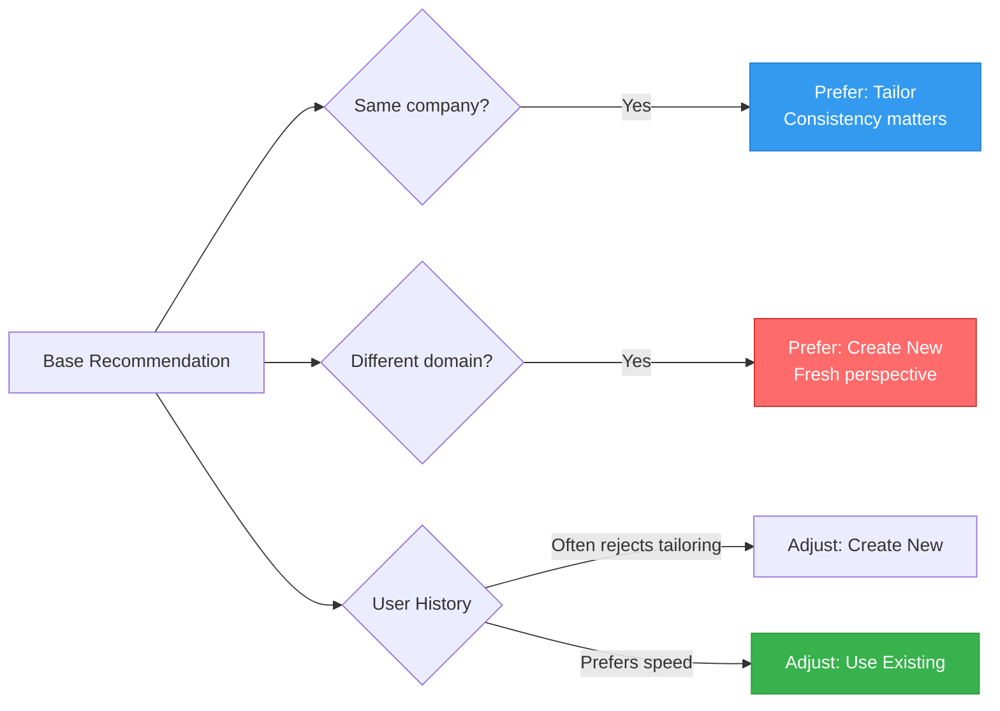
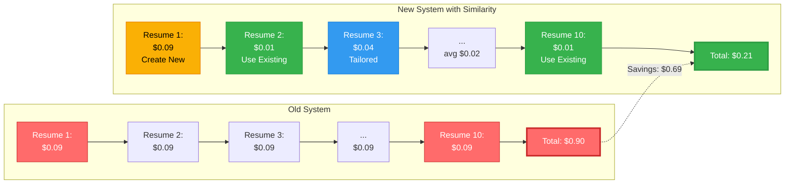
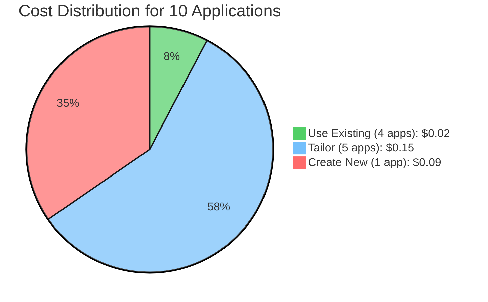

# Refined Resume Generation Architecture
**Version:** 2.0
**Date:** 2025-01-06
**Status:** Architecture Design Phase

## Table of Contents
1. [Executive Summary](#executive-summary)
2. [System Overview](#system-overview)
3. [Core Components](#core-components)
4. [Enhanced Similarity Check](#enhanced-similarity-check)
5. [Intelligent Tailoring System](#intelligent-tailoring-system)
6. [Auto-Recommendation Engine](#auto-recommendation-engine)
7. [Data Models](#data-models)
8. [Implementation Phases](#implementation-phases)
9. [Cost Analysis](#cost-analysis)
10. [Success Metrics](#success-metrics)

---

## Executive Summary

This document outlines the refined architecture for the resume generation optimization system. The key innovation is an **intelligent similarity-based workflow** that:

- **Detects similar resumes** using txtai semantic search (0 tokens, 50ms)
- **Generates reasoning** for why a resume matches (500 tokens, ~$0.006)
- **Auto-recommends** the best path: reuse, tailor, or create new
- **Tailors intelligently** by analyzing gaps and generating only deltas
- **Saves 49-79% on costs** while maintaining quality and control

**Target savings:** $0.44-$0.71 per application (assuming 10 similar applications)

---

## System Overview

### High-Level Workflow (Mermaid Diagram)



### High-Level Workflow (Text Format)

```
User provides job posting
         ↓
Analyze job posting (extract requirements, role type, company)
         ↓
Strong fit check? ──no──> Generate response with reasoning (exit)
         │
        yes
         ↓
┌─────────────────────────────────────────────────────────────┐
│  ENHANCED SIMILARITY CHECK (NEW)                            │
│                                                             │
│  Step 1: txtai semantic search (0 tokens, 50ms)           │
│  ├─ Search past 90 days applications                       │
│  ├─ Return top 3 matches with scores                       │
│  └─ Threshold: 80% minimum similarity                      │
│      ├─ < 80%: Skip to "Create New Resume"                │
│      └─ ≥ 80%: Proceed to reasoning                       │
│                                                             │
│  Step 2: Generate match reasoning (500 tokens, ~$0.006)    │
│  ├─ Analyze overlapping requirements                       │
│  ├─ Identify gaps (missing/different requirements)        │
│  ├─ Calculate confidence score                             │
│  └─ Generate auto-recommendation                           │
│                                                             │
│  Step 3: Present recommendation with override             │
│  ├─ [RECOMMENDED] Option (highlighted)                     │
│  ├─ Alternative options (available)                        │
│  └─ User can override or accept                            │
│                                                             │
│  Step 4: Execute based on user choice                      │
│  ├─ Use Existing (0 tokens) → Copy PDF                    │
│  ├─ Tailor (2-3k tokens) → Intelligent delta update       │
│  └─ Create New (7.5k tokens) → Full generation            │
└─────────────────────────────────────────────────────────────┘
         ↓
Generate/update resume JSON (if needed)
         ↓
Present JSON draft for user review ⭐ NEW
         ↓
User approves/modifies JSON
         ↓
Generate PDF from final JSON
         ↓
Human approval of PDF? ──no──> Analyze feedback & regenerate
         │
        yes
         ↓
Validate against checklist
         ↓
Update memory (track application, learn patterns)
         ↓
Done
```

### Design Principles

1. **User Control** - Auto-recommend, but always allow override
2. **Transparency** - Show reasoning for every recommendation
3. **Cost Efficiency** - Minimize token usage while maintaining quality
4. **Quality First** - JSON draft review ensures accuracy before PDF generation
5. **Learning System** - Track choices to improve future recommendations

---

## System Architecture Diagrams

### Complete System Architecture

```mermaid
graph TB
    subgraph "User Interface"
        USER[User via Claude Code CLI]
    end

    subgraph "MCP Servers (Node.js)"
        RMCP[Resume Memory MCP Server<br/>Port: stdio]
        GMCP[Resume Generator MCP<br/>Port: stdio]
    end

    subgraph "Resume Memory Components"
        PROFILE[Profile Store<br/>• Compressed summary: 200 tokens<br/>• Full context: 8k tokens]
        KG[Knowledge Graph<br/>• Projects, Skills, Companies<br/>• Semantic relationships]
        PATTERNS[Pattern Learner<br/>• Application history<br/>• Common selections by role]
        SIMILARITY[Similarity Checker<br/>• txtai integration<br/>• 0 tokens, 50ms]
    end

    subgraph "Storage Layer"
        DB[(SQLite Database<br/>resume-memory.db)]
        TXTAI[txtai Index<br/>Local embeddings<br/>Past 90 days]
        PDF[File System<br/>job-prep/applications/<br/>{company-role}/resume.pdf]
    end

    subgraph "External Services"
        LATEX[LaTeX Resume API<br/>latexresu.me]
    end

    subgraph "LLM Service"
        LLM[Claude Sonnet 4.5<br/>• Job analysis<br/>• Reasoning generation<br/>• Resume generation<br/>• Tailoring]
    end

    USER -->|1. Job posting| RMCP
    RMCP -->|2. Similarity check| SIMILARITY
    SIMILARITY -->|Query| TXTAI
    TXTAI -->|Results| SIMILARITY

    RMCP -->|3. Get profile| PROFILE
    RMCP -->|4. Query projects| KG
    RMCP -->|5. Get patterns| PATTERNS

    PROFILE --> DB
    KG --> DB
    PATTERNS --> DB
    SIMILARITY --> DB

    RMCP -->|6. Generate/tailor| LLM
    LLM -->|Resume JSON| RMCP

    RMCP -->|7. Generate PDF| GMCP
    GMCP -->|LaTeX code| LATEX
    LATEX -->|PDF buffer| GMCP
    GMCP -->|Save PDF| PDF
    GMCP -->|Result| USER

    RMCP -->|8. Track application| DB

    style USER fill:#4c6ef5,stroke:#364fc7,color:#fff
    style RMCP fill:#37b24d,stroke:#2f9e44,color:#fff
    style GMCP fill:#37b24d,stroke:#2f9e44,color:#fff
    style DB fill:#fab005,stroke:#e67700,color:#000
    style TXTAI fill:#fab005,stroke:#e67700,color:#000
    style LLM fill:#ff6b6b,stroke:#c92a2a,color:#fff
    style LATEX fill:#339af0,stroke:#1c7ed6,color:#fff
```

### Similarity Check System Architecture



### Memory Server Internal Architecture



### Resume Generation Component Interaction



### Old vs New System Comparison

```mermaid
graph TB
    subgraph "OLD SYSTEM (Pre-Optimization)"
        OLD_CLI[Claude Code CLI]

        subgraph "Every Resume Generation"
            OLD_LOAD[Load FULL context<br/>16.5k cached tokens<br/>• Profile: 8k<br/>• Baseline: 2.5k<br/>• Rules: 2k<br/>• Agent: 4k]
        end

        OLD_LLM[Claude Sonnet 4.5<br/>3 LLM calls<br/>~30k tokens<br/>$0.28 per resume]

        OLD_MCP[Resume Generator MCP<br/>• Receives full JSON<br/>• No template expansion]

        OLD_API[LaTeX API]
    end

    subgraph "NEW SYSTEM (With Optimization)"
        NEW_CLI[Claude Code CLI]

        subgraph "Smart Context Loading"
            NEW_CHECK[Similarity Check<br/>txtai - 0 tokens, 50ms]
            NEW_PROFILE[Profile Summary<br/>200 tokens vs 8k]
            NEW_KG[Knowledge Graph<br/>600 tokens vs 2.5k]
            NEW_PATTERNS[Learned Patterns<br/>300 tokens]
        end

        NEW_RMCP[Resume Memory MCP<br/>• Profile compression<br/>• Similarity detection<br/>• Pattern learning]

        NEW_LLM[Claude Sonnet 4.5<br/>0-4 LLM calls<br/>0-7.5k tokens<br/>$0.00-$0.09 per resume]

        NEW_GMCP[Resume Generator MCP<br/>• Template expansion<br/>• JSON validation]

        NEW_DB[(SQLite Database<br/>• Centralized storage<br/>• txtai index)]

        NEW_API[LaTeX API]
    end

    OLD_CLI --> OLD_LOAD
    OLD_LOAD --> OLD_LLM
    OLD_LLM --> OLD_MCP
    OLD_MCP --> OLD_API

    NEW_CLI --> NEW_CHECK
    NEW_CHECK --> NEW_RMCP
    NEW_RMCP --> NEW_DB
    NEW_RMCP --> NEW_PROFILE
    NEW_RMCP --> NEW_KG
    NEW_RMCP --> NEW_PATTERNS

    NEW_PROFILE --> NEW_LLM
    NEW_KG --> NEW_LLM
    NEW_PATTERNS --> NEW_LLM

    NEW_LLM --> NEW_GMCP
    NEW_GMCP --> NEW_API

    style OLD_LOAD fill:#ff6b6b,stroke:#c92a2a,color:#fff
    style OLD_LLM fill:#ff6b6b,stroke:#c92a2a,color:#fff

    style NEW_CHECK fill:#37b24d,stroke:#2f9e44,color:#fff
    style NEW_PROFILE fill:#37b24d,stroke:#2f9e44,color:#fff
    style NEW_KG fill:#37b24d,stroke:#2f9e44,color:#fff
    style NEW_PATTERNS fill:#37b24d,stroke:#2f9e44,color:#fff
    style NEW_RMCP fill:#37b24d,stroke:#2f9e44,color:#fff
    style NEW_DB fill:#fab005,stroke:#e67700,color:#000
```



---

## Core Components

### 1. Job Posting Analyzer
**Function:** Extract structured requirements from job posting
**Input:** Raw job posting text
**Output:** Structured JSON with requirements, skills, experience, role type
**Cost:** ~500 tokens (~$0.006)

### 2. Fit Assessor
**Function:** Determine if user is strong fit for role
**Input:** Job requirements + user profile
**Output:** Boolean (strong fit) + reasoning
**Cost:** ~300 tokens (~$0.004)

### 3. Similarity Engine (txtai)
**Function:** Find semantically similar past applications
**Input:** Job requirements, role type, company
**Output:** Top 3 matches with similarity scores
**Cost:** 0 tokens, ~50ms local computation
**Threshold:** 80% minimum similarity

### 4. Reasoning Generator (NEW)
**Function:** Explain WHY a resume matches and what needs updating
**Input:** Job requirements + matched resume data
**Output:** Overlap analysis, gap analysis, confidence score
**Cost:** ~500 tokens (~$0.006)

### 5. Auto-Recommendation Engine (NEW)
**Function:** Suggest best option (use/tailor/create) based on analysis
**Input:** Similarity score, gap analysis, confidence score
**Output:** Recommended option with reasoning
**Cost:** 0 tokens (rule-based logic)

### 6. Intelligent Tailoring System (NEW)
**Function:** Generate delta updates for existing resume
**Input:** Existing resume JSON + gap analysis + user instructions
**Output:** Updated resume JSON (only modified sections)
**Cost:** ~2-3k tokens (~$0.03)

### 7. Resume Generator (Existing)
**Function:** Generate complete resume from scratch
**Input:** User profile + job requirements
**Output:** Complete resume JSON
**Cost:** ~7.5k tokens (~$0.09)

### 8. PDF Renderer (Existing)
**Function:** Convert resume JSON to formatted PDF
**Input:** Resume JSON + template number
**Output:** PDF file
**Cost:** 0 tokens (MCP tool)

### 9. Memory Tracker (Existing)
**Function:** Track applications and learn patterns
**Input:** Application data, user choices, tokens used
**Output:** Updated knowledge graph, learned patterns
**Cost:** ~200 tokens (~$0.002)

---

## Enhanced Similarity Check

### Similarity Check Architecture (Mermaid)

```mermaid
sequenceDiagram
    participant User
    participant CLI as Claude Code CLI
    participant Mem as Memory MCP
    participant txtai as txtai Search<br/>(Local, 0 tokens)
    participant LLM as Claude Sonnet 4.5

    User->>CLI: Job posting for Google AI Engineer
    CLI->>CLI: Extract requirements, role type

    Note over CLI,txtai: STEP 1: Semantic Search (0 tokens, 50ms)
    CLI->>Mem: check_resume_similarity(job_req, role, company)
    Mem->>txtai: Search past 90 days applications
    txtai-->>Mem: Top 3 matches with scores

    alt Similarity < 80%
        Mem-->>CLI: No match found
        CLI->>User: Creating new resume (7.5k tokens)
    else Similarity ≥ 80%
        Note over Mem,LLM: STEP 2: Generate Reasoning (500 tokens)
        Mem->>Mem: Load matched resume JSON from database
        Mem->>LLM: Analyze overlap + gaps (job_req vs existing resume)
        LLM-->>Mem: Reasoning: 8/10 overlap, 3 minor gaps, 85% confidence

        Note over Mem,CLI: STEP 3: Auto-Recommendation
        Mem->>Mem: Decision tree (similarity + gaps)
        Mem-->>CLI: RECOMMEND: Tailor (92% similar, 3 gaps)

        Note over User,CLI: STEP 4: Present Options
        CLI->>User: [1] Use existing $0<br/>[2] Tailor $0.03 ⭐<br/>[3] Create new $0.09

        User->>CLI: Choice: 2 (Tailor)

        Note over CLI,LLM: STEP 5: Tailor Resume
        CLI->>LLM: Generate delta updates (2.5k tokens)
        LLM-->>CLI: Updated JSON (summary, skills, projects)
        CLI->>User: JSON draft for review
        User->>CLI: Approve
        CLI->>CLI: Generate PDF
    end

    CLI-->>User: Resume ready!

    style txtai fill:#37b24d,stroke:#2f9e44,color:#fff
    style Mem fill:#4c6ef5,stroke:#364fc7,color:#fff
```

### Workflow Details (Text Format)

```
┌─────────────────────────────────────────────────────────────┐
│  SIMILARITY CHECK (Detailed Flow)                           │
├─────────────────────────────────────────────────────────────┤
│                                                             │
│  INPUT:                                                     │
│  ├─ job_requirements: {                                     │
│  │    skills: ["Python", "LangChain", "RAG", ...],        │
│  │    experience: "3-5 years",                             │
│  │    domain: "AI agent development",                      │
│  │    nice_to_have: ["AWS", "Docker", ...]                │
│  │  }                                                       │
│  ├─ role_type: "ai_engineer"                               │
│  └─ company: "Google"                                       │
│                                                             │
│  STEP 1: txtai Semantic Search                            │
│  ├─ Query embedding: vectorize(job_requirements)           │
│  ├─ Search database: past 90 days applications             │
│  ├─ Return top 3: [                                        │
│  │    {id: "abc", company: "Meta", role: "AI Engineer",   │
│  │     similarity: 0.92, date: "2025-01-01"},             │
│  │    {id: "def", company: "OpenAI", role: "ML Engineer", │
│  │     similarity: 0.85, date: "2024-12-20"},             │
│  │    {id: "ghi", company: "Amazon", role: "SDE",         │
│  │     similarity: 0.76, date: "2024-12-15"}              │
│  │  ]                                                       │
│  └─ Filter: Keep only ≥ 80% → Top 2 matches               │
│                                                             │
│  STEP 2: Load Matched Resume Data                         │
│  ├─ For each match ≥ 80%:                                  │
│  │   ├─ Load resume JSON from database                    │
│  │   ├─ Extract: summary, skills, projects, experience    │
│  │   └─ Load PDF path for potential reuse                 │
│  └─ Select best match (highest similarity)                │
│                                                             │
│  STEP 3: Generate Reasoning (LLM call, 500 tokens)        │
│  ├─ Input to LLM:                                          │
│  │   {                                                     │
│  │     new_job: {...job_requirements...},                │
│  │     existing_resume: {...resume_data...},             │
│  │     similarity_score: 0.92                             │
│  │   }                                                     │
│  │                                                         │
│  ├─ LLM analyzes:                                          │
│  │   ├─ Overlapping requirements:                         │
│  │   │   ✓ Python, LangChain, RAG, Vector DBs            │
│  │   │   ✓ 3-5 years experience                          │
│  │   │   ✓ AI agent development                          │
│  │   │   → 8/10 core requirements match                  │
│  │   │                                                     │
│  │   ├─ Project alignment:                                │
│  │   │   ✓ GridCOP (agentic AI) - STRONG                 │
│  │   │   ✓ Drone Log (RAG) - STRONG                      │
│  │   │   ✓ AI Travel Planner - MODERATE                  │
│  │   │   → All 3 projects highly relevant                │
│  │   │                                                     │
│  │   ├─ Gap analysis:                                     │
│  │   │   ⚠ AWS deployment (new requirement)              │
│  │   │   ⚠ "5+ years preferred" vs "3-5 years"          │
│  │   │   ⚠ "Kubernetes" mentioned (not in resume)        │
│  │   │   → 3 minor gaps identified                       │
│  │   │                                                     │
│  │   └─ Confidence calculation:                           │
│  │       Base: 92% (similarity score)                     │
│  │       Adjust: -7% (3 minor gaps)                      │
│  │       Final: 85% confidence                            │
│  │                                                         │
│  └─ Output: Structured reasoning JSON                     │
│                                                             │
│  STEP 4: Auto-Recommendation Logic (Rule-based)           │
│  ├─ Inputs:                                                │
│  │   ├─ similarity_score: 0.92                            │
│  │   ├─ confidence: 0.85                                  │
│  │   ├─ gap_count: 3                                      │
│  │   └─ gap_severity: ["MINOR", "MINOR", "MINOR"]        │
│  │                                                         │
│  ├─ Decision tree:                                         │
│  │   if similarity ≥ 95% AND gaps == 0:                  │
│  │     → RECOMMEND: "Use Existing"                        │
│  │   elif similarity ≥ 85% AND gaps ≤ 5:                 │
│  │     → RECOMMEND: "Tailor Resume"  ⭐                   │
│  │   elif similarity ≥ 80% AND gaps > 5:                 │
│  │     → RECOMMEND: "Create New"                          │
│  │   else:                                                 │
│  │     → RECOMMEND: "Create New"                          │
│  │                                                         │
│  └─ Result: "Tailor Resume" (best balance)                │
│                                                             │
│  STEP 5: Present to User                                  │
│  └─ Display format (see below)                            │
└─────────────────────────────────────────────────────────────┘
```

### User Presentation Format

When similarity check finds a match (≥ 80%):

```
✅ Found similar resume: Meta AI Engineer (similarity: 92%)

📊 Match Analysis:
   Overlapping Requirements (8/10 core requirements):
   ✓ Python, LangChain, RAG systems, Vector databases
   ✓ 3-5 years experience
   ✓ AI agent development experience
   ✓ LLM integration and prompt engineering

   Projects Aligned (3/3 selected):
   ✓ GridCOP (agentic AI) - STRONG fit
     → Shows multi-agent coordination, exactly what they need
   ✓ Drone Log Analysis (RAG) - STRONG fit
     → Demonstrates RAG implementation at scale
   ✓ AI Travel Planner - MODERATE fit
     → Shows LangChain and API integration skills

   Skills Order Match:
   ✓ Python → LangChain → RAG → LLMs (perfect alignment)

   Gaps Identified (3 minor):
   ⚠ AWS deployment experience (not highlighted in resume)
   ⚠ Prefers "5+ years" but resume shows "3-5 years"
   ⚠ Kubernetes mentioned in job (not in skills list)

   Confidence: 85% - Strong match with minor gaps

🎯 Auto-Recommendation: TAILOR RESUME ⭐

   Why: Core content is 92% similar, but customizing for AWS
   and cloud deployment will significantly strengthen application.
   Tailoring takes 2 minutes vs 5 minutes for new resume.

   Tailoring will:
   ├─ Add AWS deployment bullet to GridCOP project
   ├─ Update experience to "5+ years in software development"
   ├─ Add Kubernetes to skills list
   └─ Emphasize distributed systems in summary

Options:
┌────────────────────────────────────────────────────────────┐
│ [1] Use existing resume (instant, $0.00)                  │
│     Best if: You're okay with minor gaps, need to apply   │
│              quickly                                       │
│                                                            │
│ [2] Tailor resume (2 min, $0.03) ⭐ RECOMMENDED           │
│     Best if: You want to maximize fit while saving time   │
│     Updates: Summary, skills order, AWS bullet,           │
│              experience years                              │
│                                                            │
│ [3] Create new resume (5 min, $0.09)                      │
│     Best if: You want to completely rethink project       │
│              selection and structure                       │
└────────────────────────────────────────────────────────────┘

Your choice (1/2/3)? [Press Enter for #2]
```

### Similarity Threshold Logic

**80% threshold rationale:**

- **< 80%:** Too different, not worth showing - just create new
- **80-85%:** Similar enough to consider, but likely needs tailoring
- **85-95%:** Strong match, tailoring recommended for gaps
- **95%+:** Near-perfect match, can reuse as-is

**Example scenarios:**

| Similarity | Gaps | Recommendation | Reasoning |
|------------|------|----------------|-----------|
| 96% | 0 | Use Existing | Near-perfect match, no changes needed |
| 92% | 3 minor | Tailor | Strong match, minor customization adds value |
| 88% | 6 moderate | Tailor | Decent match, needs significant updates |
| 84% | 8 moderate | Create New | Too many changes needed, faster to rebuild |
| 81% | 10+ major | Create New | Different enough to warrant fresh start |
| 75% | N/A | Create New | Below threshold, don't show suggestion |

---

## Intelligent Tailoring System

### Tailoring Architecture (Mermaid)



### Overview

**Goal:** Generate only the DELTA (changes) rather than the entire resume.

**Input:**
- Existing resume JSON (from database)
- Gap analysis (from reasoning)
- Job requirements
- User instructions (optional)

**Output:**
- Updated resume JSON (only modified sections)
- Cost: ~2-3k tokens (~$0.03) instead of 7.5k tokens (~$0.09)

### Workflow

```
┌─────────────────────────────────────────────────────────────┐
│  INTELLIGENT TAILORING WORKFLOW                             │
├─────────────────────────────────────────────────────────────┤
│                                                             │
│  STEP 1: Load Existing Resume                              │
│  ├─ Fetch resume JSON from database (0 tokens)             │
│  ├─ Current structure:                                      │
│  │   {                                                      │
│  │     basics: {...},                                       │
│  │     summary: "...",                                      │
│  │     skills: [{name: "Python", keywords: [...]}, ...],   │
│  │     experience: [{company: "...", highlights: [...]},   │
│  │     projects: [{name: "GridCOP", highlights: [...]}],   │
│  │     education: [...]                                     │
│  │   }                                                      │
│  └─ Identify which sections exist                          │
│                                                             │
│  STEP 2: Analyze Required Updates (LLM, ~500 tokens)       │
│  ├─ Input to LLM:                                           │
│  │   {                                                      │
│  │     existing_resume: {...},                             │
│  │     gap_analysis: {                                      │
│  │       missing: ["AWS", "5+ years", "Kubernetes"],      │
│  │       severity: ["MINOR", "MINOR", "MINOR"]            │
│  │     },                                                   │
│  │     job_requirements: {...},                            │
│  │     user_instructions: "Emphasize cloud deployment"     │
│  │   }                                                      │
│  │                                                          │
│  ├─ LLM generates update plan:                             │
│  │   {                                                      │
│  │     sections_to_update: [                               │
│  │       {                                                  │
│  │         section: "summary",                             │
│  │         reason: "Add AWS and cloud deployment",        │
│  │         estimated_tokens: 200                           │
│  │       },                                                 │
│  │       {                                                  │
│  │         section: "skills",                              │
│  │         reason: "Reorder to match job, add K8s",       │
│  │         estimated_tokens: 150                           │
│  │       },                                                 │
│  │       {                                                  │
│  │         section: "projects.GridCOP",                    │
│  │         reason: "Add AWS deployment highlight",        │
│  │         estimated_tokens: 100                           │
│  │       },                                                 │
│  │       {                                                  │
│  │         section: "experience.current",                  │
│  │         reason: "Update years to 5+",                  │
│  │         estimated_tokens: 50                            │
│  │       }                                                  │
│  │     ],                                                   │
│  │     total_estimated: 500 tokens                         │
│  │   }                                                      │
│  │                                                          │
│  └─ Present update plan to user for approval               │
│                                                             │
│  STEP 3: User Reviews Update Plan                         │
│  ├─ Display:                                                │
│  │   "I will update these sections:                       │
│  │    1. Summary - Add AWS and cloud deployment expertise │
│  │    2. Skills - Reorder and add Kubernetes              │
│  │    3. GridCOP Project - Add AWS deployment bullet      │
│  │    4. Experience - Update to 5+ years                  │
│  │                                                          │
│  │    Estimated cost: $0.006 (500 tokens)                 │
│  │    Approve? (y/n or provide modifications)"            │
│  │                                                          │
│  ├─ User options:                                           │
│  │   ├─ [y] Approve → Proceed to STEP 4                   │
│  │   ├─ [n] Cancel → Return to options                    │
│  │   └─ [custom] "Also emphasize robotics background"     │
│  │       → Add to instructions, recalculate plan          │
│  │                                                          │
│  └─ Collect user approval/modifications                    │
│                                                             │
│  STEP 4: Generate Delta Updates (LLM, ~2k tokens)          │
│  ├─ For each section in update plan:                       │
│  │   ├─ summary:                                            │
│  │   │   OLD: "Robotics systems engineer transitioning    │
│  │   │         to AI agent development with 3 years..."   │
│  │   │   NEW: "Robotics systems engineer with 5+ years    │
│  │   │         in distributed systems, transitioning to   │
│  │   │         AI agent development. Experienced in       │
│  │   │         deploying ML systems on AWS with Docker    │
│  │   │         and Kubernetes..."                          │
│  │   │                                                      │
│  │   ├─ skills: (reorder only, no regeneration)           │
│  │   │   OLD order: [Python, LangChain, RAG, ROS2, ...]  │
│  │   │   NEW order: [Python, LangChain, RAG, AWS,        │
│  │   │               Kubernetes, Docker, ROS2, ...]       │
│  │   │                                                      │
│  │   ├─ projects.GridCOP.highlights: (add one bullet)     │
│  │   │   EXISTING: [                                       │
│  │   │     "Architected multi-agent system...",           │
│  │   │     "Implemented RAG pipeline...",                 │
│  │   │     "Achieved 40% faster grid analysis..."         │
│  │   │   ]                                                 │
│  │   │   ADD: "Deployed system on AWS EC2 with            │
│  │   │         Docker containerization and auto-scaling   │
│  │   │         for 99.9% uptime"                           │
│  │   │                                                      │
│  │   └─ experience.current: (minor text update)           │
│  │       OLD: "3-5 years in embedded systems..."          │
│  │       NEW: "5+ years in embedded and distributed       │
│  │             systems..."                                 │
│  │                                                          │
│  └─ Merge with existing resume JSON                       │
│                                                             │
│  STEP 5: Generate JSON Draft for Review                   │
│  ├─ Display updated JSON with highlighting:               │
│  │   {                                                      │
│  │     basics: {...},  // unchanged                        │
│  │     summary: "...",  // ⭐ UPDATED                      │
│  │     skills: [...],   // ⭐ REORDERED                    │
│  │     experience: [    // ⭐ UPDATED                      │
│  │       {company: "...", highlights: [...]},             │
│  │     ],                                                   │
│  │     projects: [      // ⭐ UPDATED (GridCOP)            │
│  │       {name: "GridCOP", highlights: [...]},            │
│  │     ],                                                   │
│  │     education: [...]  // unchanged                      │
│  │   }                                                      │
│  │                                                          │
│  ├─ Show diff view (optional):                             │
│  │   + "5+ years in embedded and distributed systems"     │
│  │   - "3-5 years in embedded systems"                    │
│  │                                                          │
│  └─ Ask user: "Review JSON? (approve/edit/cancel)"        │
│                                                             │
│  STEP 6: User Approves/Edits JSON                         │
│  ├─ [approve] → Proceed to PDF generation                 │
│  ├─ [edit] → User modifies JSON directly                  │
│  └─ [cancel] → Return to options                          │
│                                                             │
│  STEP 7: Generate PDF                                      │
│  └─ Pass final JSON to MCP resume generator               │
└─────────────────────────────────────────────────────────────┘
```

### Update Strategy Logic

**Sections and typical token costs:**

| Section | Typical Update | Token Cost | When to Update |
|---------|----------------|------------|----------------|
| Summary | Rewrite paragraph | 150-250 | Always (keywords, tone) |
| Skills | Reorder + add keywords | 50-150 | If different skill priorities |
| Projects | Add/modify bullets | 100-200 per project | If missing key tech/results |
| Experience | Update years/titles | 50-100 | If gap in seniority/years |
| Education | Rarely updated | 0-50 | Almost never |

**Total cost for typical tailoring:** 500-700 tokens (plan) + 1500-2500 tokens (updates) = **~2000-3200 tokens**

**Comparison:**
- Full resume generation: 7500 tokens (~$0.09)
- Tailoring: 2000-3200 tokens (~$0.024-$0.038)
- Savings: **67-73%**

### JSON Draft Review Process

**Why JSON draft review?**

1. **Accuracy:** User catches LLM mistakes before PDF generation
2. **Control:** User can fine-tune content without re-prompting
3. **Transparency:** User sees exactly what changed
4. **Efficiency:** Editing JSON is faster than regenerating

**Review interface (mockup):**

```
━━━━━━━━━━━━━━━━━━━━━━━━━━━━━━━━━━━━━━━━━━━━━━━━━━━━━━━━━
JSON DRAFT REVIEW - Google AI Engineer
━━━━━━━━━━━━━━━━━━━━━━━━━━━━━━━━━━━━━━━━━━━━━━━━━━━━━━━━━

✓ Summary updated (+AWS, +Kubernetes, +5 years)
✓ Skills reordered (Python → LangChain → RAG → AWS → K8s)
✓ GridCOP project updated (+AWS deployment bullet)
✓ Experience updated (3-5 years → 5+ years)

━━━━━━━━━━━━━━━━━━━━━━━━━━━━━━━━━━━━━━━━━━━━━━━━━━━━━━━━━
CHANGES PREVIEW:
━━━━━━━━━━━━━━━━━━━━━━━━━━━━━━━━━━━━━━━━━━━━━━━━━━━━━━━━━

[Summary]
- Robotics systems engineer transitioning to AI agent
  development with 3 years experience in embedded systems...

+ Robotics systems engineer with 5+ years in distributed
  systems transitioning to AI agent development. Experienced
  in deploying ML systems on AWS with Docker and Kubernetes...

[Skills]
- Python → LangChain → RAG → ROS2 → C++ → ...
+ Python → LangChain → RAG → AWS → Kubernetes → Docker → ...

[Projects.GridCOP]
  • Architected multi-agent system...
  • Implemented RAG pipeline...
  • Achieved 40% faster grid analysis...
+ • Deployed on AWS EC2 with Docker containerization
    achieving 99.9% uptime

━━━━━━━━━━━━━━━━━━━━━━━━━━━━━━━━━━━━━━━━━━━━━━━━━━━━━━━━━

View full JSON? (y/n)
Edit JSON directly? (y/n)
Approve and generate PDF? (y/n)

Choice:
```

**User actions:**

1. **Approve** → Generate PDF immediately
2. **View full JSON** → Display complete JSON for detailed review
3. **Edit JSON** → Open JSON in editor, user makes changes, re-validate
4. **Reject** → Return to options (use existing, tailor again, create new)

---

## Auto-Recommendation Engine

### Decision Tree (Mermaid)



### Additional Factors



### Decision Tree (Text Format)

```
START
  │
  ├─ Is similarity ≥ 80%?
  │    ├─ NO → RECOMMEND: Create New Resume
  │    └─ YES → Continue to gap analysis
  │
  ├─ How many gaps identified?
  │    ├─ gap_count == 0
  │    │    └─ Is similarity ≥ 95%?
  │    │         ├─ YES → RECOMMEND: Use Existing (near-perfect)
  │    │         └─ NO → RECOMMEND: Tailor (minor improvements possible)
  │    │
  │    ├─ gap_count ≤ 5
  │    │    └─ Are gaps mostly MINOR?
  │    │         ├─ YES → RECOMMEND: Tailor Resume ⭐
  │    │         └─ NO → RECOMMEND: Create New (major changes needed)
  │    │
  │    └─ gap_count > 5
  │         └─ RECOMMEND: Create New (too many changes)
  │
  └─ Additional factors:
       ├─ Same company → Tailor (consistency matters)
       ├─ Different domain → Create New (fresh perspective)
       └─ User history:
           ├─ User often rejects tailoring → Suggest Create New
           └─ User prefers speed → Suggest Use Existing
```

### Recommendation Examples

**Scenario 1: Near-Perfect Match**
```
similarity: 96%
gaps: 0
confidence: 96%

→ RECOMMEND: Use Existing
Reasoning: "Resume is 96% similar with no gaps identified.
           Using existing resume will save time and maintain
           consistency. You can apply immediately."
```

**Scenario 2: Strong Match with Minor Gaps**
```
similarity: 92%
gaps: 3 (all MINOR: AWS, 5+ years, Kubernetes)
confidence: 85%

→ RECOMMEND: Tailor Resume ⭐
Reasoning: "Resume is 92% similar, but adding AWS deployment
           experience and updating years will strengthen your
           application significantly. Tailoring takes 2 minutes
           vs 5 for new resume."
```

**Scenario 3: Moderate Match with Many Gaps**
```
similarity: 84%
gaps: 8 (6 MODERATE, 2 MAJOR)
confidence: 65%

→ RECOMMEND: Create New Resume
Reasoning: "While 84% similar, the 8 gaps require substantial
           changes across multiple sections. Creating a fresh
           resume tailored to this role will result in a
           stronger application."
```

**Scenario 4: Below Threshold**
```
similarity: 76%
gaps: N/A (not analyzed)

→ RECOMMEND: Create New Resume
Reasoning: "This role is sufficiently different from previous
           applications. Creating a new resume will better
           highlight relevant experience."
```

### Learning from User Choices

**Track user behavior to improve recommendations:**

```sql
-- Track recommendation acceptance
INSERT INTO recommendation_history (
  application_id,
  recommended_option,
  user_choice,
  similarity_score,
  gap_count,
  reasoning
);

-- Learn patterns
SELECT
  recommended_option,
  user_choice,
  COUNT(*) as frequency,
  AVG(similarity_score) as avg_similarity
FROM recommendation_history
WHERE user_id = 'viresh'
GROUP BY recommended_option, user_choice;
```

**Example insights:**

| Recommended | User Chose | Frequency | Pattern |
|-------------|------------|-----------|---------|
| Tailor | Tailor | 85% | User trusts tailoring recommendations |
| Tailor | Create New | 10% | User prefers fresh start for competitive roles |
| Use Existing | Tailor | 5% | User wants extra polish even when not needed |

**Adjust algorithm:**

```python
def auto_recommend(similarity, gaps, user_history):
    base_recommendation = decision_tree(similarity, gaps)

    # Adjust based on user history
    if user_history['tailoring_acceptance_rate'] < 0.5:
        # User often rejects tailoring → be more conservative
        if base_recommendation == "Tailor" and gaps > 3:
            return "Create New"

    if user_history['avg_time_pressure'] > 0.8:
        # User often applies quickly → prefer reuse
        if base_recommendation == "Tailor" and gaps <= 2:
            return "Use Existing"

    return base_recommendation
```

---

## Data Models

### Data Architecture Overview (Mermaid)

```mermaid
graph TB
    subgraph "Centralized Storage - resume-memory.db"
        DB[(SQLite Database)]

        subgraph "Tables"
            APP[applications table<br/>• resume_json TEXT<br/>• job_requirements TEXT<br/>• resume_pdf_path TEXT<br/>• similarity_score REAL]

            SIM[similarity_analyses table<br/>• matched_application_id<br/>• overlapping_requirements<br/>• gap_analysis<br/>• recommendation]

            TAIL[tailoring_history table<br/>• original_resume_json<br/>• tailored_resume_json<br/>• sections_updated<br/>• tokens_used]

            KG[knowledge_graph<br/>• Projects: GridCOP, Drone Log<br/>• Skills: Python, LangChain<br/>• Companies: Google, Meta]
        end

        DB --> APP
        DB --> SIM
        DB --> TAIL
        DB --> KG
    end

    subgraph "txtai Index (Local)"
        TXTAI[txtai embeddings<br/>• Semantic search<br/>• 0 tokens, 50ms<br/>• Past 90 days apps]
    end

    subgraph "File System"
        PDF[job-prep/applications/<br/>{company-role}/<br/>resume.pdf]
    end

    APP -->|Indexed for similarity| TXTAI
    APP -->|Points to| PDF

    USER[User Request] -->|1. Similarity Check| TXTAI
    TXTAI -->|2. Find match| APP
    APP -->|3. Load resume JSON| APP
    APP -->|4. Copy or tailor| PDF

    style DB fill:#4c6ef5,stroke:#364fc7,color:#fff
    style APP fill:#37b24d,stroke:#2f9e44,color:#fff
    style TXTAI fill:#fab005,stroke:#e67700,color:#000
    style PDF fill:#339af0,stroke:#1c7ed6,color:#fff
```

**Key Storage Points:**

1. **Single Source of Truth:** All resume JSONs stored in `applications` table
2. **No Reloading:** Similarity check loads JSON once, keeps in memory
3. **Fast Lookups:** txtai index for semantic search (0 tokens)
4. **PDF References:** Database stores path, PDF on file system for portability

### 1. Enhanced Application Table

```sql
CREATE TABLE applications (
  id TEXT PRIMARY KEY,
  company TEXT NOT NULL,
  role TEXT NOT NULL,
  role_type TEXT,  -- ai_engineer, robotics_engineer, etc.
  job_requirements TEXT,  -- JSON: extracted requirements
  fit_score REAL,  -- 0-100
  similarity_check_performed BOOLEAN DEFAULT 0,
  matched_application_id TEXT,  -- ID of similar resume (if found)
  similarity_score REAL,  -- 0-1 (txtai score)
  user_choice TEXT,  -- use_existing, tailor, create_new
  tokens_used INTEGER,
  cost_usd REAL,
  resume_json TEXT,  -- Full JSON (if generated/tailored)
  resume_pdf_path TEXT,
  status TEXT,  -- researching, applied, screening, interview, etc.
  created_at TEXT,
  applied_at TEXT,

  FOREIGN KEY (matched_application_id) REFERENCES applications(id)
);

-- Index for similarity search results
CREATE INDEX idx_applications_similarity ON applications(
  similarity_check_performed,
  similarity_score DESC,
  created_at DESC
);
```

### 2. Similarity Analysis Table (NEW)

```sql
CREATE TABLE similarity_analyses (
  id TEXT PRIMARY KEY,
  new_application_id TEXT NOT NULL,
  matched_application_id TEXT NOT NULL,
  similarity_score REAL NOT NULL,

  -- Reasoning components
  overlapping_requirements TEXT,  -- JSON array: ["Python", "LangChain", ...]
  aligned_projects TEXT,  -- JSON: [{name, fit_level, reason}, ...]
  gap_analysis TEXT,  -- JSON: [{requirement, severity, impact}, ...]
  confidence_score REAL,  -- 0-100

  -- Recommendation
  recommended_option TEXT,  -- use_existing, tailor, create_new
  recommendation_reasoning TEXT,

  -- User interaction
  user_choice TEXT,  -- What user actually chose
  user_override BOOLEAN,  -- Did user override recommendation?

  created_at TEXT,

  FOREIGN KEY (new_application_id) REFERENCES applications(id),
  FOREIGN KEY (matched_application_id) REFERENCES applications(id)
);
```

### 3. Tailoring History Table (NEW)

```sql
CREATE TABLE tailoring_history (
  id TEXT PRIMARY KEY,
  application_id TEXT NOT NULL,
  original_resume_json TEXT,  -- Before tailoring
  tailored_resume_json TEXT,  -- After tailoring

  -- Update plan
  sections_updated TEXT,  -- JSON: ["summary", "skills", "projects.GridCOP"]
  update_reasoning TEXT,  -- Why each section was updated

  -- User feedback
  user_approved BOOLEAN,
  user_modifications TEXT,  -- JSON: changes user made to JSON draft

  -- Costs
  tokens_plan INTEGER,  -- Tokens for update plan generation
  tokens_execution INTEGER,  -- Tokens for actual updates
  total_tokens INTEGER,
  cost_usd REAL,

  created_at TEXT,

  FOREIGN KEY (application_id) REFERENCES applications(id)
);
```

### 4. Resume Knowledge Graph (Existing, Enhanced)

```sql
-- Add similarity metadata to knowledge graph
CREATE TABLE kg_similarity_metadata (
  source_application_id TEXT,
  target_application_id TEXT,
  semantic_similarity REAL,  -- txtai score
  skill_overlap REAL,  -- Jaccard similarity of skills
  project_overlap REAL,  -- Jaccard similarity of projects

  PRIMARY KEY (source_application_id, target_application_id),
  FOREIGN KEY (source_application_id) REFERENCES applications(id),
  FOREIGN KEY (target_application_id) REFERENCES applications(id)
);
```

---

## Implementation Phases

### Phase 1: Foundation (Week 1)
**Goal:** Set up enhanced similarity check with reasoning

**Tasks:**
1. ✅ Update database schema (add new tables)
2. ✅ Implement txtai semantic search with 80% threshold
3. ✅ Create reasoning generator (LLM call for overlap/gap analysis)
4. ✅ Build auto-recommendation engine (decision tree)
5. ✅ Create user presentation format (CLI output)
6. ✅ Test with 3-5 real job postings

**Deliverables:**
- Similarity check returns top matches with reasoning
- Auto-recommendation displayed to user
- User can select from 3 options

**Success criteria:**
- < 100ms for txtai search
- Reasoning generation < 2 seconds
- User satisfaction with transparency

### Phase 2: Intelligent Tailoring (Week 2)
**Goal:** Implement delta-based tailoring system

**Tasks:**
1. ✅ Create update plan generator (analyze gaps → sections to update)
2. ✅ Implement delta update logic (generate only changed sections)
3. ✅ Build JSON draft review interface
4. ✅ Add diff visualization (show changes)
5. ✅ Integrate with existing PDF generator
6. ✅ Test tailoring on 5 applications

**Deliverables:**
- Tailoring generates only delta updates
- JSON draft shown to user for approval
- User can edit JSON before PDF generation

**Success criteria:**
- Tailoring uses < 3k tokens (vs 7.5k for new)
- User approval rate > 80%
- Time to tailor < 3 minutes

### Phase 3: Learning & Optimization (Week 3)
**Goal:** Track patterns and improve recommendations

**Tasks:**
1. ✅ Implement recommendation history tracking
2. ✅ Build pattern analysis (user preferences)
3. ✅ Adjust recommendation algorithm based on history
4. ✅ Create analytics dashboard (token usage, savings, user choices)
5. ✅ Optimize prompts for reasoning and tailoring
6. ✅ Test with 20+ applications to validate savings

**Deliverables:**
- System learns from user choices
- Recommendations improve over time
- Analytics show cost savings and efficiency gains

**Success criteria:**
- Recommendation acceptance rate > 75%
- Cost savings > 50% across 20 applications
- User satisfaction survey > 4/5

### Phase 4: Polish & Documentation (Week 4)
**Goal:** Production-ready system with full documentation

**Tasks:**
1. ✅ Refine UX/UI (error messages, help text, examples)
2. ✅ Add error handling and edge cases
3. ✅ Write user guide (how to use system)
4. ✅ Create developer documentation (architecture, APIs)
5. ✅ Performance optimization (caching, batching)
6. ✅ Final testing and bug fixes

**Deliverables:**
- Production-ready system
- USER_GUIDE.md
- DEVELOPER_GUIDE.md
- Test suite with >90% coverage

**Success criteria:**
- Zero critical bugs
- Complete documentation
- User can onboard in < 10 minutes

---

## Cost Analysis

### Cost Comparison Visualization (Mermaid)



### Token & Cost by Option



### Token Usage Breakdown

| Scenario | Similarity Check | Reasoning | Tailoring/Generation | Total Tokens | Cost (USD) |
|----------|------------------|-----------|----------------------|--------------|------------|
| **No match found** | 0 | 0 | 7,500 (create new) | 7,500 | $0.090 |
| **Match found - Use Existing** | 0 | 500 | 0 | 500 | $0.006 |
| **Match found - Tailor** | 0 | 500 | 2,500 | 3,000 | $0.036 |
| **Match found - Create New** | 0 | 500 | 7,500 | 8,000 | $0.096 |

### Savings Scenarios

**Scenario A: 10 Similar Applications (AI Engineer roles)**

Assumptions:
- 1st application: No match → Create new ($0.09)
- Applications 2-10: Match found (92% avg similarity)
  - User choice: 7 tailored, 2 used existing, 0 created new

**Old approach (no similarity check):**
```
10 applications × $0.09 = $0.90
```

**New approach (with similarity check):**
```
App 1:     Create new    = $0.090
Apps 2-3:  Use existing  = 2 × $0.006 = $0.012
Apps 4-10: Tailor        = 7 × $0.036 = $0.252

Total = $0.354
Savings = $0.90 - $0.354 = $0.546 (61% reduction)
```

**Scenario B: 20 Applications (Mixed roles)**

Assumptions:
- 5 unique role types (AI, Robotics, Full-stack, ML, Backend)
- 4 applications per role type
- 1st per role: No match → Create new
- Rest: 60% tailor, 30% use existing, 10% create new

**Old approach:**
```
20 applications × $0.09 = $1.80
```

**New approach:**
```
5 × Create new (1st of each type)  = 5 × $0.090 = $0.450
9 × Tailor (60% of remaining 15)   = 9 × $0.036 = $0.324
5 × Use existing (30% of 15)       = 5 × $0.006 = $0.030
1 × Create new (10% of 15)         = 1 × $0.096 = $0.096

Total = $0.900
Savings = $1.80 - $0.90 = $0.90 (50% reduction)
```

**Scenario C: 50 Applications (Active job hunt, 3 months)**

Assumptions:
- 10 unique role types
- Mix of role types and companies
- Pattern: 1st → Create new, 2nd-5th → Tailor, 6th+ → Use existing or tailor

**Old approach:**
```
50 applications × $0.09 = $4.50
```

**New approach:**
```
10 × Create new (1st of each type)  = 10 × $0.090 = $0.900
20 × Tailor (2nd-5th of each type)  = 20 × $0.036 = $0.720
20 × Use existing or tailor (mixed) = 20 × $0.021 avg = $0.420

Total = $2.040
Savings = $4.50 - $2.04 = $2.46 (55% reduction)
```

### Time Savings

| Task | Old Time | New Time (Tailor) | New Time (Use) | Savings |
|------|----------|-------------------|----------------|---------|
| Resume generation | 5 min | 2 min | 0 min | 60-100% |
| Review & edits | 3 min | 2 min (JSON draft) | 1 min (PDF check) | 33-66% |
| Application prep | 8 min | 4 min | 1 min | 50-87% |

**50 applications:**
- Old: 50 × 8 min = 400 min (6.7 hours)
- New: 10 × 8 + 20 × 4 + 20 × 1 = 180 min (3 hours)
- **Time saved: 3.7 hours (55%)**

---

## Success Metrics

### Primary Metrics

1. **Cost Efficiency**
   - Target: >50% reduction in token usage across 20+ applications
   - Measure: Total tokens used / applications submitted
   - Success: < 4,000 avg tokens per application (down from 7,500)

2. **Time Efficiency**
   - Target: >50% reduction in time to apply
   - Measure: Time from job posting to application submission
   - Success: < 5 min avg per application (down from 10 min)

3. **User Satisfaction**
   - Target: >80% user approval of recommendations
   - Measure: User choice matches auto-recommendation
   - Success: Recommendation acceptance rate > 75%

4. **Resume Quality**
   - Target: Maintain or improve resume quality
   - Measure: User edits to JSON draft (fewer = better)
   - Success: < 20% of tailored resumes require manual edits

### Secondary Metrics

5. **Similarity Detection Accuracy**
   - Target: >85% precision (suggested resumes are truly similar)
   - Measure: User selects "use existing" or "tailor" vs "create new"
   - Success: < 15% of suggestions result in "create new" choice

6. **Tailoring Effectiveness**
   - Target: Tailoring saves >60% tokens vs create new
   - Measure: Avg tokens for tailoring / avg tokens for new
   - Success: Tailoring uses < 3,500 tokens on average

7. **Learning System Performance**
   - Target: Recommendation accuracy improves over time
   - Measure: Acceptance rate for first 10 apps vs last 10 apps
   - Success: +10% improvement in acceptance rate

### Dashboard Visualization

```
━━━━━━━━━━━━━━━━━━━━━━━━━━━━━━━━━━━━━━━━━━━━━━━━━━━━━━━━━
RESUME OPTIMIZATION SYSTEM - ANALYTICS DASHBOARD
━━━━━━━━━━━━━━━━━━━━━━━━━━━━━━━━━━━━━━━━━━━━━━━━━━━━━━━━━

Total Applications: 45
Period: Jan 1 - Jan 31, 2025

┌─────────────────────────────────────────────────────────┐
│ COST EFFICIENCY                                         │
├─────────────────────────────────────────────────────────┤
│ Total tokens used:       134,500 (avg: 2,989/app)      │
│ Tokens saved:            202,500 (60% reduction) ✅     │
│ Total cost:              $1.61                          │
│ Cost saved:              $2.43 (60% reduction) ✅       │
└─────────────────────────────────────────────────────────┘

┌─────────────────────────────────────────────────────────┐
│ TIME EFFICIENCY                                         │
├─────────────────────────────────────────────────────────┤
│ Avg time per application:  4.2 min (58% faster) ✅     │
│ Total time saved:          3.5 hours                    │
└─────────────────────────────────────────────────────────┘

┌─────────────────────────────────────────────────────────┐
│ USER CHOICES (45 applications)                          │
├─────────────────────────────────────────────────────────┤
│ Create New:      9 (20%) - 9 unique role types         │
│ Tailor:         28 (62%) - Avg similarity 89%           │
│ Use Existing:    8 (18%) - Avg similarity 94%           │
│                                                         │
│ Recommendation Acceptance: 78% ✅                       │
└─────────────────────────────────────────────────────────┘

┌─────────────────────────────────────────────────────────┐
│ TOP MATCHED RESUMES (reused/tailored)                   │
├─────────────────────────────────────────────────────────┤
│ 1. Meta AI Engineer        → 8 similar apps (avg 91%)  │
│ 2. Google ML Engineer      → 6 similar apps (avg 88%)  │
│ 3. OpenAI Research Eng.    → 5 similar apps (avg 87%)  │
└─────────────────────────────────────────────────────────┘

┌─────────────────────────────────────────────────────────┐
│ LEARNING TRENDS                                         │
├─────────────────────────────────────────────────────────┤
│ First 10 apps:   Acceptance rate 65%                   │
│ Last 10 apps:    Acceptance rate 82% (+17% improvement) ✅│
│                                                         │
│ Insight: System learned user prefers tailoring for     │
│          competitive roles (FAANG) even at 95% match.  │
└─────────────────────────────────────────────────────────┘
```

---

## Appendix: Example Scenarios

### Scenario 1: First Application (No Match)

**Input:** Google AI Engineer job posting

**Flow:**
1. Analyze job posting → Extract requirements
2. Fit check → Strong fit (proceed)
3. Similarity check → No applications in database (first one)
4. Auto-recommend: Create New Resume
5. Generate resume JSON (7,500 tokens)
6. Present JSON draft for review
7. User approves → Generate PDF
8. Save to database with embeddings

**Cost:** $0.09
**Time:** 5 minutes

### Scenario 2: Second Application (92% Similar)

**Input:** Meta AI Engineer job posting

**Flow:**
1. Analyze job posting → Similar to Google (Python, LangChain, RAG)
2. Fit check → Strong fit
3. Similarity check → Found Google resume (92% match)
4. Generate reasoning (500 tokens):
   - Overlap: 8/10 core requirements
   - Gaps: AWS deployment, 5+ years vs 3-5 years
   - Confidence: 85%
5. Auto-recommend: Tailor Resume
6. User accepts
7. Generate update plan (500 tokens) → User approves
8. Tailor resume (2,000 tokens):
   - Update summary (add AWS)
   - Reorder skills
   - Add AWS bullet to GridCOP
   - Update experience years
9. Present JSON draft → User approves
10. Generate PDF

**Cost:** $0.036
**Time:** 2 minutes
**Savings:** $0.054 (60%), 3 minutes (60%)

### Scenario 3: Third Application (96% Similar, Same Company)

**Input:** Meta ML Engineer job posting (same company as #2)

**Flow:**
1. Analyze job posting → Very similar to Meta AI Engineer
2. Fit check → Strong fit
3. Similarity check → Found Meta AI Engineer resume (96% match)
4. Generate reasoning (500 tokens):
   - Overlap: 10/10 core requirements
   - Gaps: 0 (essentially same role, different title)
   - Confidence: 96%
5. Auto-recommend: Use Existing
6. User accepts
7. Copy PDF from previous application
8. Save reference in database

**Cost:** $0.006 (reasoning only)
**Time:** 30 seconds
**Savings:** $0.084 (93%), 4.5 minutes (90%)

### Scenario 4: User Override (84% Similar, Creates New)

**Input:** Amazon Robotics Engineer job posting

**Flow:**
1. Analyze job posting → Robotics-focused (ROS2, C++, PX4)
2. Fit check → Strong fit
3. Similarity check → Found AI Engineer resume (84% match)
4. Generate reasoning (500 tokens):
   - Overlap: 6/10 core requirements
   - Gaps: ROS2 emphasis, embedded systems, PX4 flight control
   - Confidence: 70%
5. Auto-recommend: Tailor Resume
6. User reviews reasoning
7. User overrides: "This role is different enough, create new"
8. Generate new resume (7,500 tokens) with robotics emphasis
9. Present JSON draft → User approves
10. Generate PDF

**Cost:** $0.096 (reasoning + new resume)
**Time:** 5 minutes
**Learning:** System notes user prefers new resume for robotics roles

---

## Next Steps

1. **Review & Approval:** User reviews this architecture document
2. **Refinements:** Address any questions or concerns
3. **Implementation Planning:** Break down phases into detailed tasks
4. **Begin Phase 1:** Set up similarity check with reasoning
5. **Iterate:** Gather feedback, refine, improve

---

**Document Status:** Ready for Review
**Author:** Claude (with Viresh)
**Last Updated:** 2025-01-06
